# Cómo tener una terminal 🔝

Una imagen vale más que mil palabras, con lo cual, unos cuantos GIF valdrán muchas más:

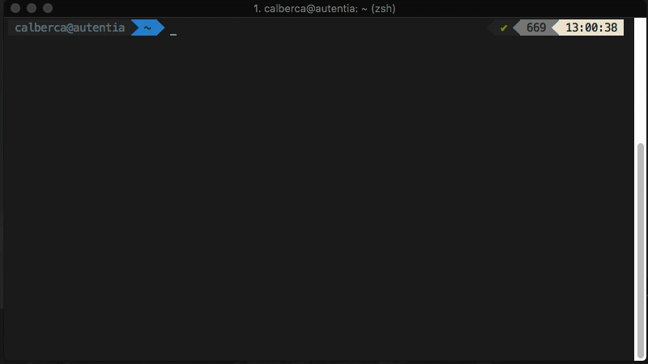

Autocompletado de git:

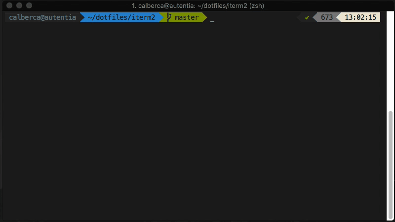

Podremos navegar fácilmente por los últimos directorios usados con [Z](https://github.com/rupa/z):

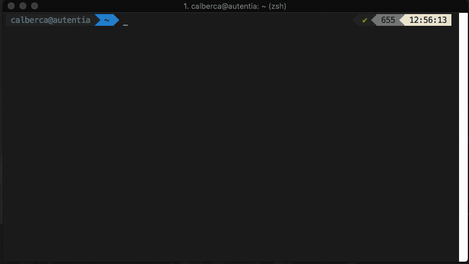

Tendremos un fuzzy finder para encontrar todo lo que queramos con [fzf](https://github.com/junegunn/fzf):

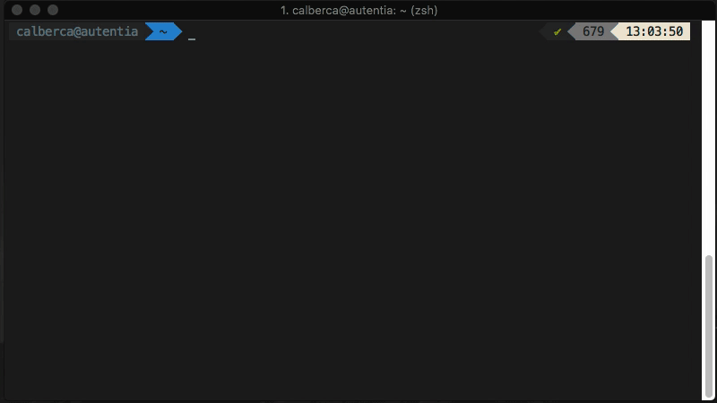

El buscar documentación será mucho más fácil con [tldr](https://tldr.sh/):


¿Tú también quieres todo esto? Sigue este tutorial para tener el mejor terminal de todos.

## Requisitos

* Homebrew 1.3.6

## Instalación de ZSH

Todo es mucho más fácil con [Homebrew](https://brew.sh/) y si estás en Linux también disponemos de un gestor de paquetes parecido a Homebrew: [Linuxbrew](linuxbrew.sh). Si estás en Windows, estás de mala suerte, ya que no se puede. Prueba a mirar con el [subsistema de de Bash para windows](https://msdn.microsoft.com/en-us/commandline/wsl/install_guide), quizás se pueda hacer ahí.

El resto del tutorial usaremos Homebrew, los pasos serán muy parecidos con otros gestores, de tener problemas tendremos que mirar en la documentación de cada utilidad que se mencione.

Ahora bien, para comenzar instalaremos [zsh](http://www.zsh.org/) con Homebrew. Así que abrimos terminal e introducimos el siguiente comando:

```bash
brew install zsh
```

Además instalaremos las [zsh-completions](https://github.com/zsh-users/zsh-completions), ya que son necesarias para `oh my zsh` (utilidad que veremos más adelante):

```bash
brew install zsh-completions
```

Lo siguiente será tener [git](https://git-scm.com/) instalado, para más tarde poder instalar `oh my zsh`:

```bash
brew install git
```

Bien, ahora instalaremos [oh my zsh](https://github.com/robbyrussell/oh-my-zsh). Oh my zsh gestiona de forma automática la configuración de zsh, además cuenta con un montón de [plugins](https://github.com/robbyrussell/oh-my-zsh/tree/master/plugins), [temas](https://github.com/robbyrussell/oh-my-zsh/wiki/External-themes) y [utilidades](https://github.com/robbyrussell/oh-my-zsh/tree/master/tools).

Para instalarlo ejecutaremos desde terminal el siguiente comando:

```bash
sh -c "$(curl -fsSL https://raw.githubusercontent.com/robbyrussell/oh-my-zsh/master/tools/install.sh)"
```

Ahora reiniciamos el terminal y veremos que nos ha configurado ya zsh:

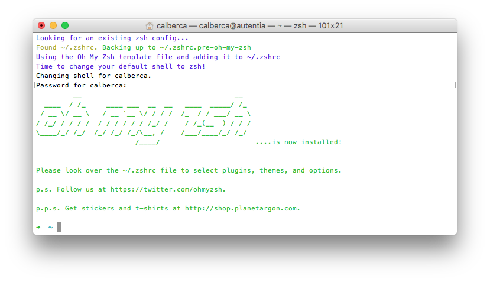

Prueba a hacer `cd` desde una carpeta cualquier y dale a tabulador, podrás navegar usando o bien tabulador o las flechas del teclado.

## Cambiar el tema

Vamos a ir más allá y vamos a instalar un tema como el que mostraba al principio:

```bash
git clone https://github.com/bhilburn/powerlevel9k.git ~/.oh-my-zsh/custom/themes/powerlevel9k
```

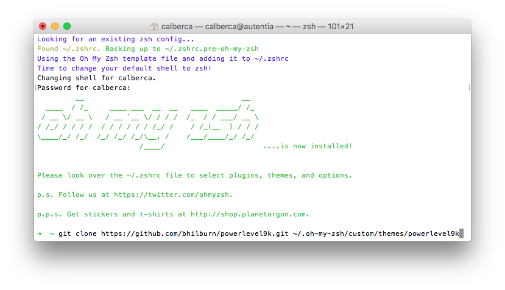

Una vez hecho esto, hay que editar nuestro fichero `.zshrc`, que sería lo equivalente al `.bashrc`. Usaremos `nano` para ello:

```bash
nano ~/.zshrc
```

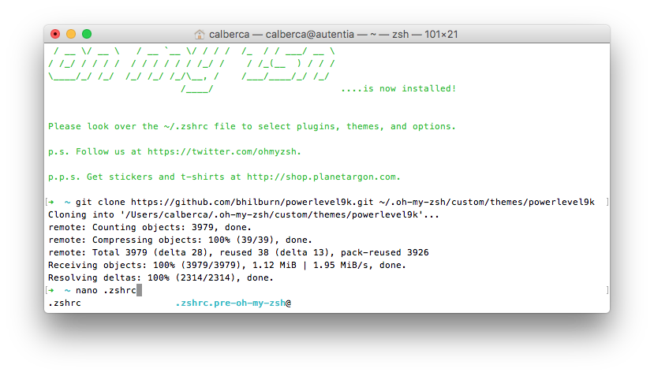

Modificar el tema por defecto por el siguiente:

```bash
ZSH_THEME="powerlevel9k/powerlevel9k"
```

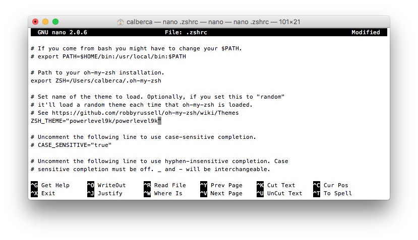

Reiniciamos el terminal y redoble de tambores...


Uff, qué feo. ¿Por qué? Pues porque este tema usa de caracteres especiales con tal de mostrarlos como iconos, con lo que tendremos que descargar una fuente de tipo [powerline](https://github.com/powerline/fonts).

## Instalación de fuentes

Y cómo no, hay un [tap de fuentes en Homebrew](https://github.com/caskroom/homebrew-fonts), con lo que descargar e instalar la fuente será cuestión de dos comandos:

```bash
brew tap "caskroom/fonts"
```

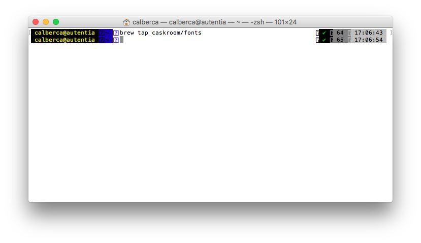

Y una vez hecho el tap podemos instalar la fuente que queramos de [este repositorio de fuentes](https://github.com/caskroom/homebrew-fonts). Yo uso la Meslo, con lo cual instalaré esa:

```bash
brew cask install font-meslo-for-powerline
```

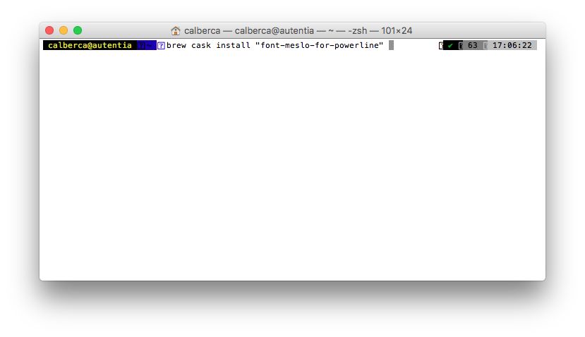

## Actualizar fuente en Terminal

Por último, modificamos la fuente del terminal para coger la fuente que acabamos de instalar. Con lo que, debemos ir a `Terminal/Preferencias`:

Dentro de las preferencias ir a perfiles:

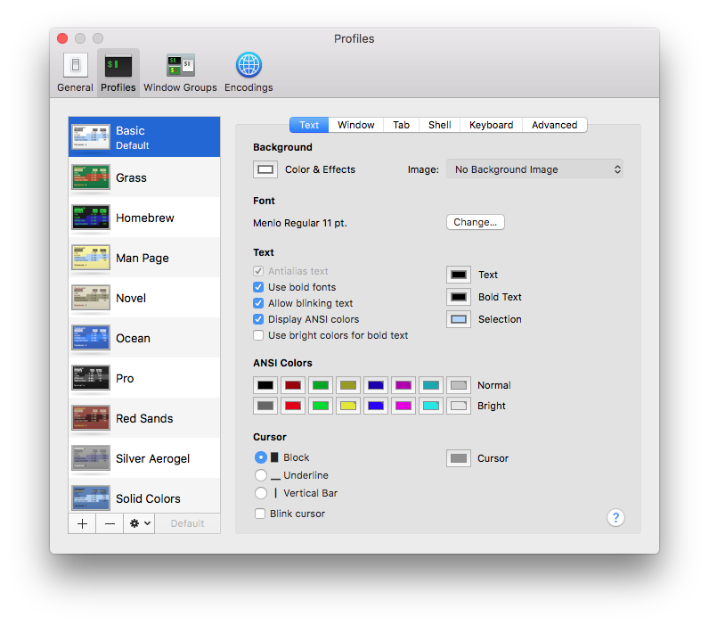

Dentro de texto, le damos a cambiar fuente y elegimos una de las fuentes de Meslo. Hay varios pesos, elegir el que más os guste, a mi me agrada el peso M con un tamaño de 13 puntos:

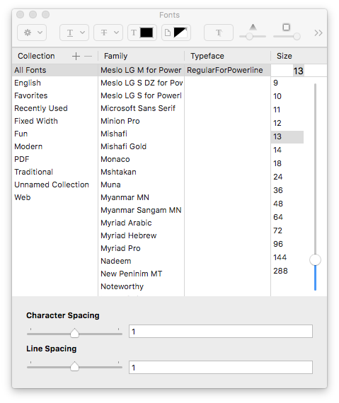

Ahora sí que tiene mejor pinta:

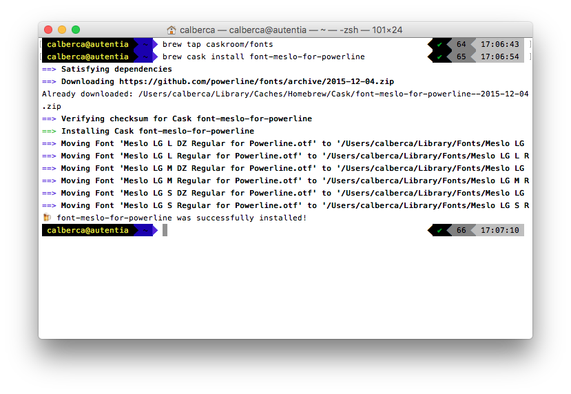

Aunque los colores siguen sin ser de mi gusto, con lo que os invito a que elijais un tema más apto. Yo uso un [Solarized Dark](http://ethanschoonover.com/solarized) personalizado. Además, en vez de hacer uso de la aplicación nativa del terminal, uso [iTerm 2](https://www.iterm2.com/). El tema de Solarized Dark para terminal nativo podéis encontrarlo [aquí](https://github.com/tomislav/osx-terminal.app-colors-solarized), con tal de tener algo parecido a esto:

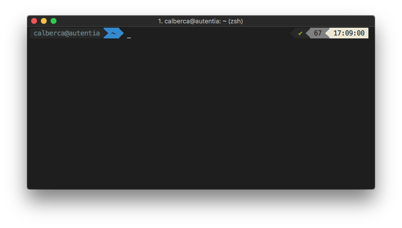

Qué bonico 😍.

## Instalar utilidades

Instalar [Z](https://github.com/rupa/z) es trivial con Homebrew:

```bash
brew install z
```

Al igual que [fzf](https://github.com/junegunn/fzf)

```bash
brew install fzf
```

Y [tldr](https://tldr.sh/) no podría ser menos:

```bash
brew install tldr
```

Y ya podemos hacer todo lo que mostramos al principio del tutorial. Así de fácil. Os recomiendo que hecheis un vistazo a su documentación, con tal de aprender las herramientas.

## Conclusiones

¿Qué pasa si me cambio de máquina? ¿Tengo que hacer todos estos pasos y estar configurando todo de nuevo? No, por supuesto que no. Podemos hacer uso de un repositorio de [Github](https://github.com) para tener versionada nuestra configuración, y una vez cambiemos de máquina clonarlo y tener un script que instalaría y configuraría todo. Esto son los denominados [dotfiles](https://dotfiles.github.io/).

Aquí os muestro [mis dotfiles](https://github.com/cesalberca/dotfiles), donde pongo las opciones del Mac como a mí me gustan, instalo todos los programas que suelo usar, configuro mi terminal e instalo y aplico las fuentes.

En otro tutorial os enseñaré como hacer vuestros propios dotfiles. ¡Hasta entonces!
