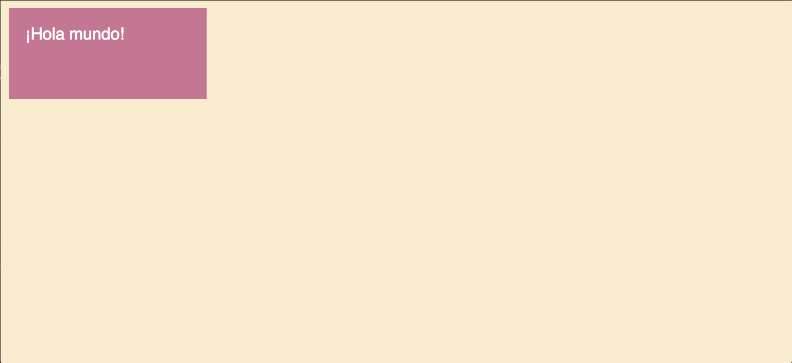
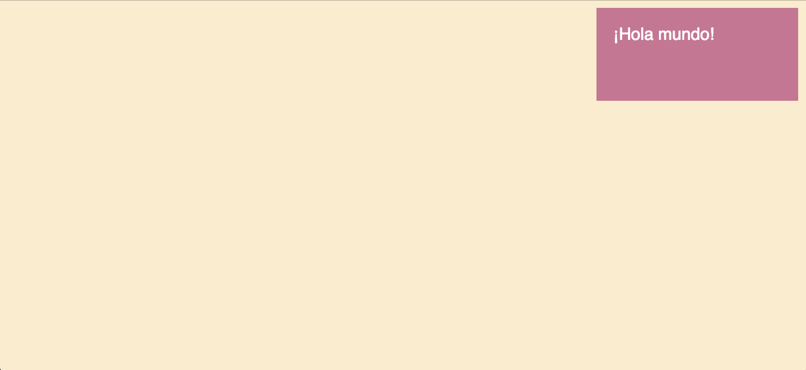
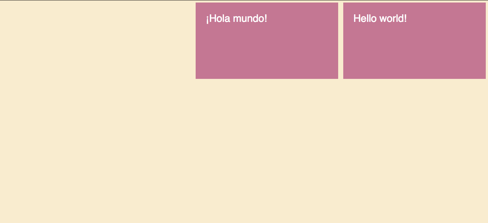
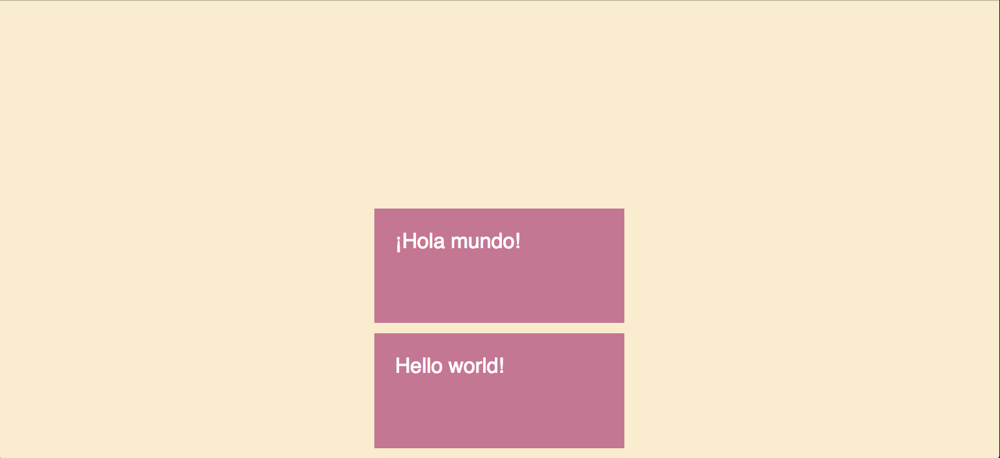
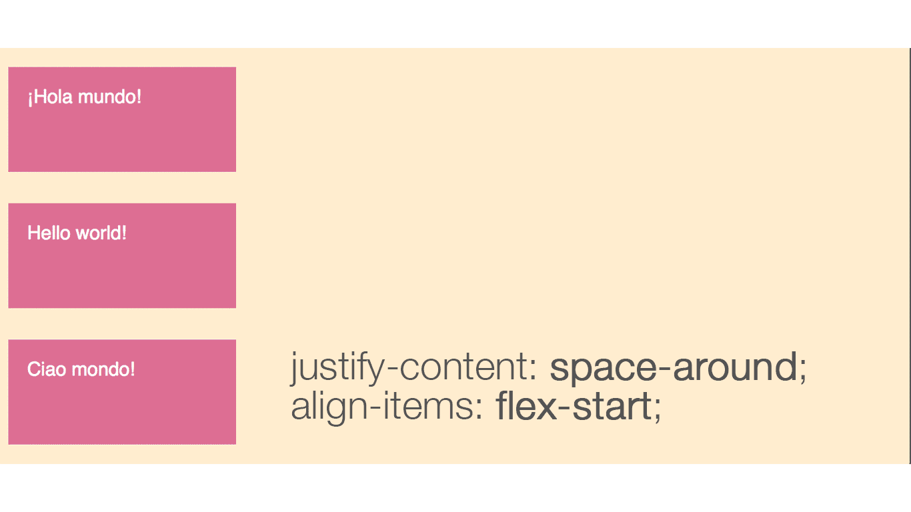
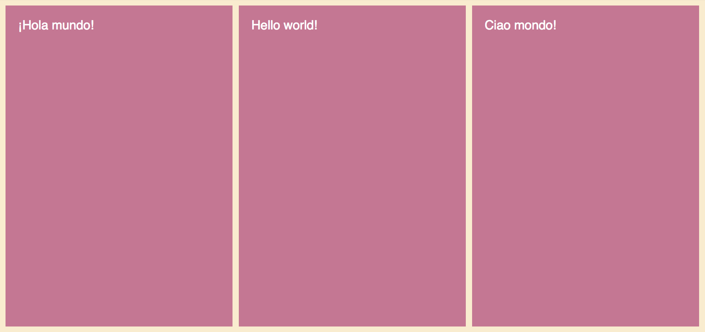
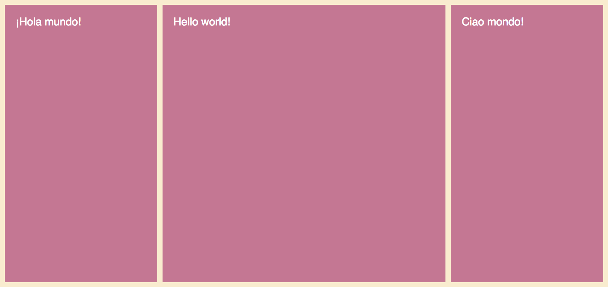

¿Todavía usando tablas para maquetar? ¿Harto de usar floats? ¿Ni pajolera idea de cómo alinear verticalmente elementos? Pues con __flexbox__ todo se hace más fácil.
<!-- more -->

<!-- START doctoc -->

<!-- END doctoc -->

## Historia de la maquetación

La semántica en HTML ha ido cada vez a mejor con la aparición de nuevos elementos que provocan que con un vistazo a la estructura y a los nombres de las etiquetas de nuestro markup podamos inferir cómo se va a representar gráficamente nuestra página.

Pero, con la aparición de la web 2.0 se veía cada vez más que no solamente se debiese presentar la información tan buenamente estructurada como pudiese ser, si no que además tenía que ser visualmente agradable. Con lo que se empezaron a reordenar los elementos con HTML y CSS para formar layouts nuevos y complejos. Todo esto se empezó a hacer con el elemento `table`. El problema es que ahora nuestro HTML dejaba de ser semántico, puesto que el elemento `table` lo que ha de representar es una información tabulada.

Y de ahí pasamos a usar `floats`. Lo bonito de esta solución es que ya no quedaba nuestro HTML plagado de etiquetas `td` y `tr` y se pasaba a hacer uso de clases de CSS para indicar cómo debía quedar representada nuestra página. Pero los floats tenían un problema, nunca se diseñaron para una labor como lo es la maquetación. Su cometido era alinear imágenes y texto. Por lo que teníamos que hacer uso de hacks para conseguir gobernar nuestra web.

Viendo que la maquetación no era algo trivial muchos frameworks de CSS surgieron, entre ellos el más conocido: [Bootrstrap](https://getbootstrap.com/), pero también tenemos otros como [Foundation](https://foundation.zurb.com/) o [Pure](https://purecss.io/).

Hasta que el comité W3C decidió incluir mejorar para solventar la maquetación y por ello propuso [la especificación para flexbox](https://www.w3.org/TR/css-flexbox-1/). En resumidas cuentas Flexbox es un mecanismo para maquetar de forma __flexible__, con facilidades para la __justificación__ y __alineación__ de elementos. Funciona mediante __contenedores__ e __hijos__.

## Introducción a Flexbox

En flexbox tenemos un contenedor y uno o varios hijos. El contenedor es el elemento al que le vamos a indicar que se ponga en disposición flex con `display: flex;`. Esto hará que todos los elementos hijo inmediatos se coloquen a lo largo de un eje principal. Como siempre es todo mejor verlo con un ejemplo:

```html
<section>
  <div>¡Hola mundo!</div>
</section>
```

```css
section {
  display: flex;
  width: 100%;
  height: 100vh;
  padding: 0.5rem;
  background-color: blanchedalmond;
}

div {
  width: 25vw;
  height: 25vh;
  margin: 0.5rem;
  padding: 2rem;
  font-size: 2rem;
  color: white;
  background-color: palevioletred;
}
```

Y además, vamos a añadir este selector al principio de __todos nuestros CSS__:

```css
* {
  box-sizing: border-box;
}
```

¿Sabes lo que hace `box-sizing: border-box;`? Verás, con la propiedad box-sizing se puede redefinir de qué manera ha de calcular la altura y la anchura de los elementos de nuestra página. Es prácticamente obligatorio definir esta propiedad si queremos que nuestra maquetación sea predecible.

Lo que indica `border-box` es que tanto los __paddings__ y __bordes__ se apliquen en el __interior de la caja__. [Aquí tienes más información](https://developer.mozilla.org/en-US/docs/Web/CSS/box-sizing).

Y esto produce lo siguiente:



Impresionante, ¿verdad? Pues no mucho si somos francos. La verdadera magia es cuando aplicamos propiedades al contenedor.

## Contenedor

El contenedor recibe una serie de propiedades muy interesantes. Entre ellas tenemos `justify-content` y que nos permite hacer lo siguiente:

```css
section {
  display: flex;
  width: 100%;
  height: 100vh;
  justify-content: flex-end;
  padding: 0.5rem;
  background-color: blanchedalmond;
}
```



Esto ya pinta más interesante. Pero... ¿qué acabamos de hacer? Pues verás, cuando disponemos un elemento en modo flex lo que hacemos es colocar los elementos hijos a lo largo de __un eje principal__.

Y con `justify-content` podemos alinear los elementos __del eje principal__. En el caso anterior hemos puesto `flex-end` que lo alinea al final. El valor por defecto es `flex-start`. Veremos todas las demás propiedades más tarde.

En cuanto a los ejes el eje por defecto es `row`. Y se puede modificar con `flex-direction`. Por ello vamos a probar a añadir un nuevo elemento al HTML:

```html
<section>
  <div>¡Hola mundo!</div>
  <div>Hello world!</div>
</section>
```



Y como hemos mencionado antes, el eje principal puede ser modificado:

```css
section {
  background-color: blanchedalmond;
  display: flex;
  width: 100%;
  height: 100vh;
  padding: 0.5rem;
  justify-content: flex-end;
  flex-direction: column;
}
```


Si nos fijamos bien, vemos que los elementos se han dispuesto en filas. Y no solo eso, si no que vemos que los elementos se han alineado abajo del todo.

Además podemos alinear en el eje secundario con `align-items`:

```css
section {
  display: flex;
  width: 100%;
  height: 100vh;
  justify-content: flex-end;
  align-items: center;
  flex-direction: column;
  padding: 0.5rem;
  background-color: blanchedalmond;
}
```



Esta vez hemos decidido alinear al centro con `center`. Y los demás valores que tanto `justify-content` como `align-items` pueden recibir son los siguientes:

```css
div {
  justify-content: flex-start | flex-end | center | space-between | space-around | space-evenly;
  align-items: flex-start | flex-end | center | baseline | stretch;
}
```

Lo mejor para asimilar lo que hace cada uno es irlo probando vosotros mismos. Aun así os dejo aquí un mini resumen. El contenedor viene definido en todos los casos con `flex-direction` a `row`:



Aquí os dejo una [guía completa de flexbox](https://css-tricks.com/snippets/css/a-guide-to-flexbox/) por si queréis indagar más.

## Hijos

Otra parte importante de flexbox y que hasta ahora no hemos visto es su flexibilidad inherente. En los ejemplos anteriores hemos estado jugando con la justificación y alineación, pero si nos fijamos vemos que hemos definido los elementos con unos tamaño explícitos.

Una propiedad importante que reciben los hijos es `flex`. Flex es una propiedad "acortada", es decir que por debajo son 3 propiedades distintas:

* `flex-grow`: Define la habilidad de un hijo de ocupar espacio sobrante. Recibe un entero. Por defecto es 0.
* `flex-shrink`: Define la habilidad de un hijo de encogerse. Recibe un entero.
* `flex-basis`: Esta propiedad especifica el tamaño base que ocupa un elemento hasta que este se puede encoger o ensancharse. Su valor puede ser una unidad o `auto` (cuyo valor es el por defecto).

Aunque dispongamos de estas propiedades se recomienda usar el método acortado `flex`, dado que este asigna valores inteligentemente.

La firma de flex es la siguiente:

```css
div {
  flex: none | [ <'flex-grow'> <'flex-shrink'>? || <'flex-basis'> ]
}
```

El valor de flex por defecto es `0 1 auto`.

Habiendo explicado el mecanismo de flex, ¿qué podemos hacer con él?

```css
section {
  display: flex;
  width: 100%;
  height: 100vh;
  padding: 0.5rem;
  background-color: blanchedalmond;
}

div {
  background-color: palevioletred;
  flex: 1;
  font-size: 2rem;
  color: white;
  padding: 2rem;
  margin: 0.5rem;
}
```



Y lo mejor de todo es que podemos alternar los flex para modificar "el peso de un elemento":

```html
<section>
  <div>¡Hola mundo!</div>
  <div class="hello-world">Hello world!</div>
  <div>Ciao mondo!</div>
</section>
```

```css
.hello-world {
  flex: 2;
}
```



## Responsividad avanzada

Vamos a pasar con responsividad. Si maquetamos con flexbox podemos llegar a hacer interacciones como las siguientes:

<video src="../imgs/maquetacion-con-flexbox/css-flex-responsive.webm" style="width: 100%;" autoplay muted loop>
</video>

Esto se puede hacer con el siguiente HTML:

```html
<section>
  <div>¡Hola mundo!</div>
  <div>Hello world!</div>
  <div>Ciao mondo!</div>
  <div>Привет мир!</div>
  <div>Hallo wereld!</div>
</section>
```

Y su CSS pertinente:

```css
section {
  display: flex;
  width: 100%;
  height: 100vh;
  padding: 0.5rem;
  background-color: blanchedalmond;
  flex-wrap: wrap;
}

div {
  background-color: palevioletred;
  font-size: 2rem;
  color: white;
  flex: 1 400px;
  padding: 2rem;
  margin: 0.5rem;
}
```

Hay una propiedad nueva: `flex-wrap`. Esta propiedad se aplica al contenedor y permite disponer a los hijos en varias lineas si surgiese la casuística de que no consiguiesen caber en una única línea.

Otra propiedad importante es `flex: 1 400px;`. Si os acordáis `flex` es un método acortado cuyo primer valor es el máximo que puede abarcar un elemento y la segunda unidad especifica el mínimo que puede abarcar.

Y como en el contenedor hemos dicho que intentase meter todos los elementos posibles lo que hará será hasta que un nuevo elemento de 400px quepa en la fila superior este se repartirá el espacio sobrante entre todos los elementos de esa fila a partes iguales ergo pasará lo que hemos visto en el video.

## Comparativa

Para aquellos que hayan visto [mi tutorial de CSS Grid]() se preguntarán cómo encaja flexbox en la maquetación si ya disponemos de una herramienta como grid. Pues bien, grid se usa para maquetar en __dos dimensiones__ mientras que flexbox se usa comunmente para maquetar en __una dimensión__.

Por ejemplo, supongamos que tenemos una página. La estructura y el layout se haría con grid mientras que las celdas de la grilla bien podrían ser bloques de flexbox.

## Conclusión
