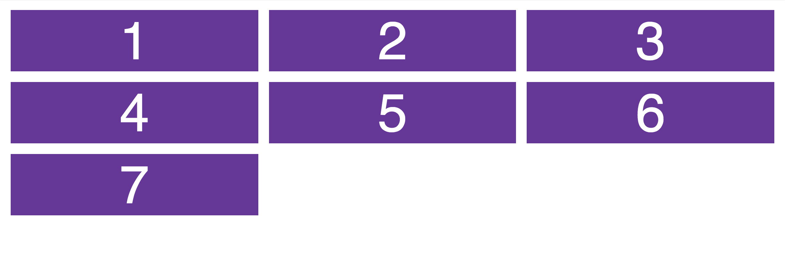
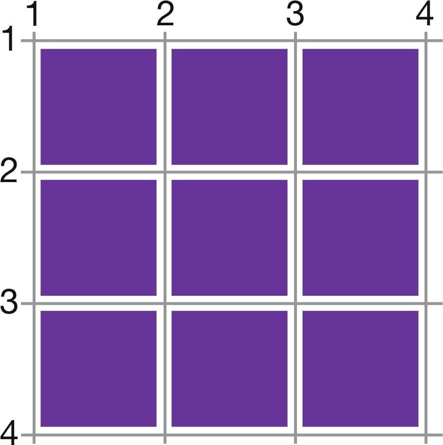
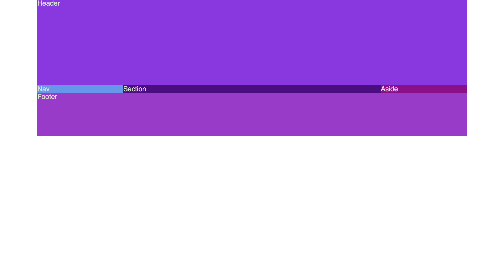
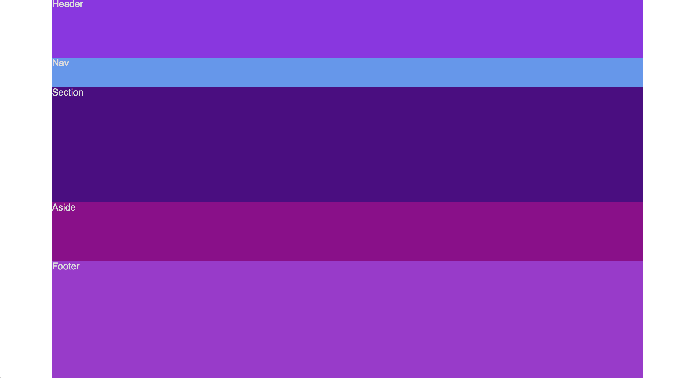
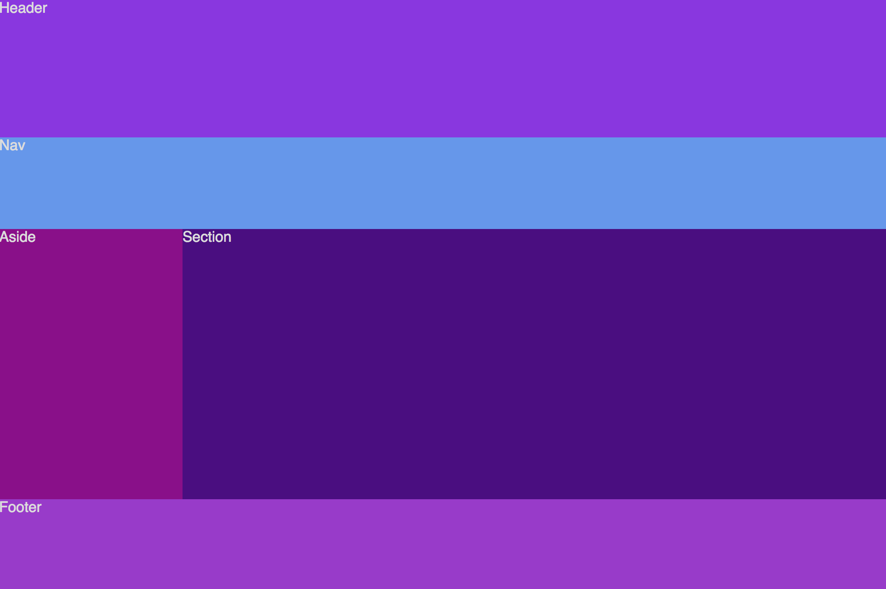
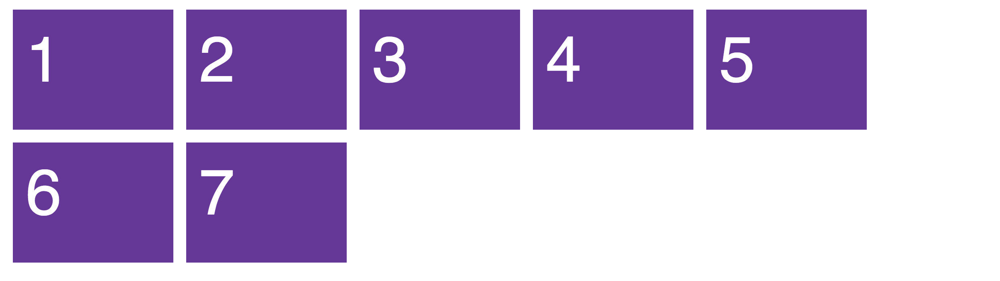

La maquetación con CSS siempre ha sido... _inesperada_. Llena de tablas con infinitas columnas y filas, incontables floats y clears sin ton ni son. Y por supuesto con Bootstrap, aunque claro, si querías salir de lo establecido mucha suerte. Todo esto cambia con __Grid__.

<!-- more -->

<!-- START doctoc generated TOC please keep comment here to allow auto update -->
<!-- DON'T EDIT THIS SECTION, INSTEAD RE-RUN doctoc TO UPDATE -->
## Índice

- [CSS Grid](#css-grid)
- [Layouts con grid-template-areas](#layouts-con-grid-template-areas)
- [repeat().](#repeat)
- [Responsividad avanzada](#responsividad-avanzada)
- [CSS Grid avanzado](#css-grid-avanzado)

<!-- END doctoc generated TOC please keep comment here to allow auto update -->

## CSS Grid

[CSS grid](https://developer.mozilla.org/en-US/docs/Web/CSS/grid) es un sistema de maquetación basado en grillas y se caracteriza por ser __bidimensional__, __independiente del orden__ del markup y __flexible__. _Extremadamente_ flexible.

Veamos ejemplos. ¿Cómo haríamos el siguiente layout?



Pues con CSS Grid sería tan fácil como a partir del siguiente HTML:

```html
<main>
  <div>1</div>
  <div>2</div>
  <div>3</div>
  <div>4</div>
  <div>5</div>
  <div>6</div>
  <div>7</div>
</main>
```

Haríamos lo siguiente:

```css
main {
  display: grid;
  grid-gap: 1rem;
  grid-template-columns: 200px 200px 200px;
  grid-template-rows: 150px 150px;
}
```

_Nota: Se han obviado algunos estilos meramente visuales._

Como vemos en el CSS de la clase `container` decimos a este elemento que su modo `display` es `grid`. Lo que quiere decir que los __hijos inmediatamente descendientes__ serán parte de la grilla.

El siguiente punto importante es `grid-gap: 10px`. Este línea lo que hace es incluir un "gutter" o canal de rejilla de 10px para separar los elementos de la grilla.

Con `grid-template-columns` lo que hacemos es definir el número de columnas y el ancho de las mismas. En este caso se han definido 3 columnas de 300px cada una.

Con `grid-template-rows` más de lo mismo, solo que esta vez estamos definiendo el número de filas. En nuestro ejemplo hemos definido 2 filas de 150px cada una. Además, el algoritmo que usa grid es lo suficiente inteligente como para colocar de forma esperada elementos extra, como es nuestro caso, ya que hemos definido 2 filas pero hemos incluido un séptimo elemento que se coloca en una tercera fila no definida.

Aquí tenéis el resultado:

<p data-height="265" data-theme-id="light" data-slug-hash="YYwVRQ" data-default-tab="result" data-user="cesalberca" data-embed-version="2" data-pen-title="CSS Grid - 1A" class="codepen">See the Pen <a href="https://codepen.io/cesalberca/pen/YYwVRQ/">CSS Grid - 1A</a> by César (<a href="https://codepen.io/cesalberca">@cesalberca</a>) on <a href="https://codepen.io">CodePen</a>.</p>
<script async src="https://production-assets.codepen.io/assets/embed/ei.js"></script>

Como vemos el HTML queda absolutamente pristino, no hay necesidad de añadir clases utilitarias para filas y columnas. En un ejemplo posterior veremos de qué manera podremos hacer que el número de celdas sea dinámico.

## Colocar elementos en la grilla

Hemos visto que los elementos se colocan solos. Pero, ¿qué pasa si queremos colocar los elementos nosotros? Un buen caso de uso sería para el siguiente layout:


Por esta razón podemos hacer uso de `grid-column-start` y `grid-column-end` para colocar en las columnas o `grid-row-start` y `grid-row-end` para las filas. O también podemos hacer uso del método acortado `grid-column: X / Y;` y `grid-row: X / Y;` siendo X e Y el número de columna y fila respectivamente.

Cuando definimos una grilla de 3 columnas por debajo se generan 4 líneas como se puede observar en el siguiente gráfico:



Y pasa lo mismo con las filas.

Así que una vez explicado este contexto vamos con el código:

```html
<main>
  <div class="item-a">
    
  </div>
  <div>
    
  </div>
  <div class="item-b">
    
  </div>
  <div>
    
  </div>
  <div class="item-c">
    
  </div>
  <div>
    
  </div>
  <div>
    
  </div>
  <div class="item-d">
    
  </div>
</main>
```

Pasamos a incluir el CSS:

```css
main {
  max-width: 800px;
  padding: 1rem;
  margin: 0 auto;
  display: grid;
  grid-template-columns: 200px 200px 200px;
  grid-template-rows: 200px 200px 200px;
  grid-gap: 1rem;
}

img {
  object-fit: cover;
  width: 100%;
  height: 100%;
  border-radius: 10px;
}

.item-a {
  grid-row: 1 / 3;
}

.item-b {
  grid-column: 3 / 5;
}

.item-c {
  grid-row: 2 / 4;
}

.item-d {
  grid-column: 3 / 5;
}
```

Este es el resultado:

<p data-height="300" data-theme-id="20649" data-slug-hash="aEdGwj" data-default-tab="result" data-user="cesalberca" data-embed-version="2" data-pen-title="CSS Grid - Masonry" class="codepen">See the Pen <a href="https://codepen.io/cesalberca/pen/aEdGwj/">CSS Grid - Masonry</a> by César (<a href="https://codepen.io/cesalberca">@cesalberca</a>) on <a href="https://codepen.io">CodePen</a>.</p>
<script async src="https://production-assets.codepen.io/assets/embed/ei.js"></script>

## Layouts con grid-template-areas

CSS Grid no solamente permite hacer de nuestra maquetación más flexible, si no que además es un motor muy potente para diseñar layouts en __dos dimensiones__. Por ejemplo veamos uno de los layouts más usados a lo largo de la web. El denominado _holy grail_:


En este ejemplo haremos un diseño _mobile-first_, es decir comenzaremos maquetando para móvil e iremos avanzando por los puntos de ruptura pasando por tablet y posteriormente a desktop.

Esto facilita bastante las cosas, si no me crees puedes leer más [aquí](https://zellwk.com/blog/how-to-write-mobile-first-css/).

Primero definimos el HTML:

```html
<main>
  <header>Header</header>
  <nav>Nav</nav>
  <section>Section</section>
  <aside>Aside</aside>
  <footer>Footer</footer>
</main>
```

Y comenzamos especificando el contenedor, en este caso será `main`:

```css
main {
  color: gainsboro;
  margin: 0 auto;
  max-width: 1000px;
  min-height: 100vh;
  display: grid;
}
```

Los estilos aplicados lo único que hacen es aplicar un máximo de ancho de 1000px. Es recomendable hacer uso del max-width dado que en monitores especialmente grandes no queremos que el ancho de la web sea el total del mismo.

También especificamos un mínimo de altura con vh ([Viewport Height](https://css-tricks.com/fun-viewport-units/)). Esto hará que aunque no tengamos mucho contenido en nuestra sección de contenido nos aseguramos que el footer queda abajo del todo. Si lo quitásemos quedaría tal que así:



Ahora vamos a incluir las columnas y las filas. En nuestro diseño inicial vemos que en modo móvil disponemos de 5 filas y 1 única columna. En CSS se traduce de la siguiente forma:

```css
grid-template-columns: 100%;
grid-template-rows: 100px
  50px
  1fr
  100px
  200px;
```

_Nota: Para que resulta más visual suelo colocar las rows de manera vertical en el código y las columnas en horizontal._

También añadiremos algunos colores, para que se vea todo mejor. Con lo que nuestro CSS sería el siguiente:

```css
main {
  color: gainsboro;
  margin: 0 auto;
  max-width: 1000px;
  min-height: 100vh;
  display: grid;
  grid-template-columns: 100%;
  grid-template-rows: 100px
    50px
    1fr
    100px
    200px;
}

header {
  background-color: blueviolet;
}

nav {
  background-color: cornflowerblue;
}

aside {
  background-color: darkmagenta;
}

section {
  background-color: indigo;
}

footer {
  background-color: darkorchid;
}
```

Y si nos fijamos atentamente veremos un nueva unidad: `fr`. Esta unidad de medida es propia de CSS Grid e indica que un elemento debería ocupar una fracción determinada del espacio restante.

El resultado tendría que ser el siguiente:



La pregunta ahora es la siguiente: ¿Cómo reordenamos los elementos? Es aquí donde entran en juego `grid-template-areas` y `grid-area`. Es mucho mejor visto en un ejemplo:

A cada _sección_ de nuestra web le asignamos un `grid-area`:

```css
header {
  grid-area: header;
  background-color: blueviolet;
}

nav {
  grid-area: nav;
  background-color: cornflowerblue;
}

aside {
  grid-area: aside;
  background-color: darkmagenta;
}

section {
  grid-area: section;
  background-color: indigo;
}

footer {
  grid-area: footer;
  background-color: darkorchid;
}
```

Y la magia la veremos en el contenedor (main) con `grid-template-areas`:

```css
grid-template-areas:
  "header header header"
  "nav nav nav"
  "section section section"
  "aside aside aside"
  "footer footer footer"
```

De forma que __en el código veremos cómo quedaría nuestro layout gráficamente__. Y contamos con la ventaja que el orden de los elementos en HTML es completamente independiente. ¿Os imagináis cómo haremos para reordenar los elementos en tableta? Pues introduciremos una [media query](https://developer.mozilla.org/en-US/docs/Web/CSS/Media_Queries/Using_media_queries) y simplemente añadiremos el siguiente CSS:

```css
grid-template-columns: 200px 1fr 200px;
grid-template-rows: 150px
  100px
  1fr
  100px;
grid-template-areas:
  "header header header"
  "nav nav nav"
  "aside section section"
  "footer footer footer"
```

El CSS hasta este punto sería el siguiente:

```css
main {
  color: gainsboro;
  margin: 0 auto;
  max-width: 1000px;
  min-height: 100vh;
  display: grid;
  grid-template-columns: 100%;
  grid-template-rows: 100px
    50px
    1fr
    100px
    200px;
  grid-template-areas:
    "header header header"
    "nav nav nav"
    "section section section"
    "aside aside aside"
    "footer footer footer"
}

header {
  grid-area: header;
  background-color: blueviolet;
}

nav {
  grid-area: nav;
  background-color: cornflowerblue;
}

aside {
  grid-area: aside;
  background-color: darkmagenta;
}

section {
  grid-area: section;
  background-color: indigo;
}

footer {
  grid-area: footer;
  background-color: darkorchid;
}

@media (min-width: 600px) and (max-width: 1000px) {
  main {
    grid-template-columns: 200px 1fr 200px;
    grid-template-rows: 150px
      100px
      1fr
      100px;
    grid-template-areas:
      "header header header"
      "nav nav nav"
      "aside section section"
      "footer footer footer"
  }
}
```

Visualmente quedaría tal que así:



Y por último nos queda el media query para desktop:

```css
@media (min-width: 1001px) {
  main {
    grid-template-columns: 200px 1fr 200px;
    grid-template-rows: 200px
      1fr
      100px;
    grid-template-areas:
      "header header header"
      "nav section aside"
      "footer footer footer"
  }
}
```

Aquí teneís el código completo:

<p data-height="318" data-theme-id="light" data-slug-hash="xpGvvb" data-default-tab="result" data-user="cesalberca" data-embed-version="2" data-pen-title="CSS Grid - Holy grail" class="codepen">See the Pen <a href="https://codepen.io/cesalberca/pen/xpGvvb/">CSS Grid - Holy grail</a> by César (<a href="https://codepen.io/cesalberca">@cesalberca</a>) on <a href="https://codepen.io">CodePen</a>.</p>
<script async src="https://production-assets.codepen.io/assets/embed/ei.js"></script>

_Nota: Prueba a sustituir dentro de `grid-template-areas` un area por `.`._

## repeat().

Entonces, con grid-template-columns si quiero crear una grilla de 12 columnas tendría que hacerlo tal que así:

```css
grid-template-columns: 1fr 1fr 1fr 1fr 1fr 1fr 1fr 1fr 1fr 1fr 1fr 1fr;
```

Pues no, dado que tenemos la función `repeat()`, cuyo primer argumento es el número de repeticiones y el segundo argumento es la unidad a repetirse:

```css
grid-template-columns: repeat(12, 1fr);
```

Aunque aquellos que vengáis de [Bootstrap](https://getbootstrap.com/) deciros que no tenemos que trabajar por un sistema de columnas y filas de una forma tan rígida. No, la belleza de CSS Grid es que podremos crear las columnas y filas a nuestro antojo y bajo demanda.

De hecho, en el ejemplo anterior si tuviésemos el siguiente CSS:

```css
@media (min-width: 1001px) {
  main {
    grid-template-columns: repeat(3, 1fr);
    grid-template-rows: 200px
      1fr
      100px;
    grid-template-areas:
      "header header header"
      "nav section aside"
      "footer footer footer"
  }
}
```

Y quisiésemos un sistema de 12 columnas con el siguiente código:

```css
@media (min-width: 1001px) {
  main {
    grid-template-columns: repeat(12, 1fr);
    grid-template-rows: 200px
      1fr
      100px;
    grid-template-areas:
      "header header header header header header header header header header header header"
      "nav nav nav nav section section section section aside aside aside aside"
      "footer footer footer footer footer footer footer footer footer footer footer footer"
  }
}
```

__No tendría absolutamente ninguna diferencia visual__. En [este artículo](https://medium.freecodecamp.org/my-friend-john-made-a-mistake-in-css-grid-dont-be-like-john-do-this-instead-91649f480da1) se explica en mayor medida esta _trampa_. Esto no quiere decir que ya no sea necesario un sistema de grillas de un número determinado de columnas, lo que quiere decir es que tenemos la libertad de elegir el número de columnas y filas dependiendo del diseño.

## Responsividad avanzada

¿Cómo haríamos la siguiente interacción?


Esto lo podremos hacer con `auto-fit`. Queremos que las celdas ocupen 200px y que se coloquen en una fila siempre y cuando haya espacio.

```css
grid-template-columns: repeat(auto-fit, 200px);
```

De esta forma el número de elementos será dinámico, contando que haya 200px libres. Pero el problema ahora es que van a quedar espacios en blanco en ciertos puntos:



Por esta razón tenemos `minmax()`; una función que especifica un mínimo y un máximo. Nuestro mínimo en este caso serían 200px y el máximo sería 1fr, de esta forma si hay menos de 200px libres los elementos abarcarían todo el espacio disponible y en el momento en el que hay 200px libres se añade un elemento:

```css
grid-template-columns: repeat(auto-fit, minmax(200px, 1fr));
```

De esta forma tenemos la interacción que se ha mostrado anteriormente.

Aquí tenéis el código:

<p data-height="265" data-theme-id="light" data-slug-hash="YYXmWz" data-default-tab="result" data-user="cesalberca" data-embed-version="2" data-pen-title="CSS Grid - Galería reponsiva avanzada" class="codepen">See the Pen <a href="https://codepen.io/cesalberca/pen/YYXmWz/">CSS Grid - Galería reponsiva avanzada</a> by César (<a href="https://codepen.io/cesalberca">@cesalberca</a>) on <a href="https://codepen.io">CodePen</a>.</p>
<script async src="https://production-assets.codepen.io/assets/embed/ei.js"></script>

## CSS Grid avanzado

Como hemos visto con `grid-template-areas`, `grid-template-rows` y `grid-template-columns` podemos lograr maquetación en CSS de manera fácil y efectiva. Pero solamente hemos visto la punta del iceberg, puesto que CSS Grid trae consigo un montón más de funcionalidades y mejoras.

Por ejemplo podemos tener control absoluto del alineamiento que toman todos los elementos dentro de la grilla tanto horizontalmente con `justify-items` como verticalmente con `align-items`. También disponemos con `justify-content` o `align-content` formas de alinear la grilla como tal en el eje X o el Y.

Aquí tenéis una [guía completa de CSS Grid](https://css-tricks.com/snippets/css/complete-guide-grid/).

## Conclusión

Veremos cada vez más y más que grid será la solución definitiva para la maquetación web. Ofrece todo aquello que necesitamos, siendo fácil de comenzar con ello, totalmente flexible y muy completo.
