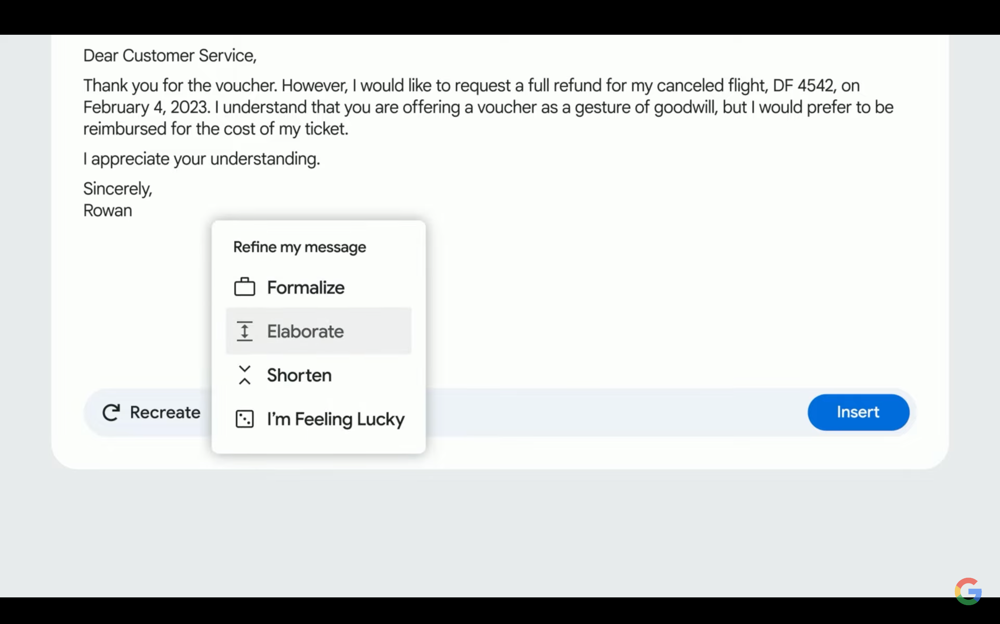

# Ofimática con IA

## Introducción

Las IA se están apoderando del mundo, y la ofimática no es una excepción. En este artículo vamos a ver como grandes empresas como Microsoft y Google están integrando la IA para mejorar nuestra productividad en el trabajo y repasaremos las nuevas novedades que nos traen las suites ofimáticas más populares.

## Suite de Microsoft

[Microsoft está integrando Copilot](https://news.microsoft.com/es-xl/presentamos-el-programa-microsoft-365-copilot-early-access-y-nuevas-capacidades-en-copilot/) en su suite en productos como Outlook, Word y Powerpoint. Inicialmente, [fue anunciado en marzo](https://news.microsoft.com/es-xl/presentamos-a-su-copiloto-para-el-trabajo-microsoft-365-copilot/) y se puede usar en diversos productos de su suite. Desgraciadamente, todavía no se puede usar en Europa, pero se espera que llegue pronto.

La tecnología detrás de estos avanzas la han denominado "Copilot System" y se basa en 3 pilares fundamentales: Microsoft 365 apps, Microsoft Graph y un Large Language Model.

* Microsoft 365 apps: es la suite ofimática de Microsoft, que incluye Word, Excel, Powerpoint, Outlook, etc.
* Microsoft Graph: es el contexto que se genera a partir de los datos del usuario, como ficheros, emails, chats, etc
* Large Language Model: es un modelo de lenguaje que se entrena con los datos y es capaz de generar texto a partir de un contexto.

Las apps de Microsoft 365 envían el contexto a Microsoft Graph, que a su vez lo envía al Large Language Model, que genera texto y lo devuelve a la app. Este texto puede ser una sugerencia de texto, una respuesta a un email, una recomendación de un archivo, etc.

Por ejemplo

## Suite de Google

Google lleva integrando IA en su suite ofimática con funcionalidades como Smart reply (es una funcionalidad que nos permite responder a un email con una respuesta corta) y Smart compose (es una funcionalidad que nos permite escribir más rápido).

En la Keynote de este año anunciaron que para su suite de ofimática integrarían una funcionalidad nueva: Help me write.

Esta funcionalidad nos permite a partir de un prompt generar texto. Esto nos puede servir para generar un email, un documento, etc. Es capaz de identificar el contexto en el que se halla el usuario y generar texto acorde a este contexto.

En el ejemplo que dieron en la keynote el usuario recibía un email diciendo que su vuelo era cancelado y que por tanto la compañía aérea ofrecía dos opciones al usuario: un reembolso o unos puntos de vuelo.

El usuario prefiere pedir un reembolso, con lo que usó Help me write que está integrado dentro de gmail.

El usuario pide que genera una respuesta para pedir el reembolso del vuelo.

La IA genera una respuesta que el usuario puede decidir si aceptar, recrear o refinar.

En la parte de refinar se ven varias opciones para hacer más formal el mensaje, que sea más elaborado, más corto o una opción "Tengo suerte".

Eligiendo la opción de elaborar se genera un mensaje más largo.

Esto es parte de la propuesta de Google para su suite ofimática, pero no es la única. También han anunciado que integrarán Smart canvas, que es una funcionalidad que nos permite crear documentos más interactivos y colaborativos y que se basa en inteligencia artificial para generar resúmenes.

## Futuro

La IA está llegando a todos los ámbitos de nuestra vida, y la ofimática no se está quedando atrás. En este artículo hemos visto cómo Microsoft y Google están integrando IA en sus suites ofimáticas y cómo nos puede ayudar a ser más productivos.

En el futuro veremos cómo las IAs tendrán más integraciones para sugerir fórmulas en Google Sheets y Microsoft Excel, para generar imágenes para las presentaciones libres de derechos de autor y para generar tanto resúmenes de contenido, como generar contenido a partir de un resumen.

