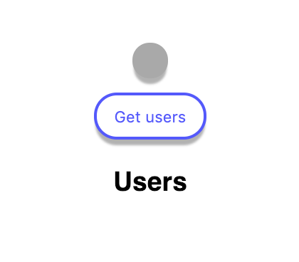
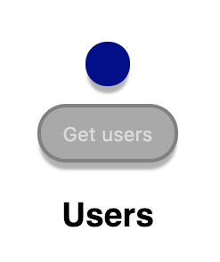
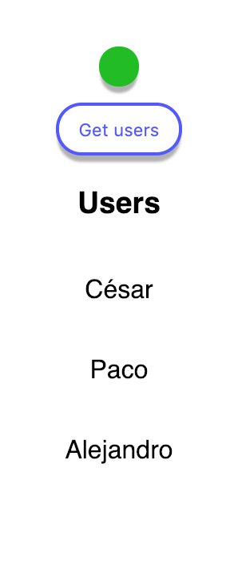
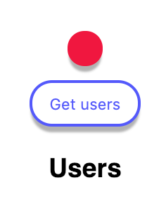

#

El mundo frontend es conocido por su gran _volatilidad_, sin embargo poco hacemos para que esta volatilidad no afecte a nuestros desarrollos. Nos importa últimamente estar más __a la última del framework del momento que de aprender a hacer nuestro código más mantenible__. Así que este tutorial irá en pos de hacer una aplicación lo más _"Frameworkless"_ posible.

## Problema

Nuestro usuario tiene el siguiente problema: dado que su aplicación Web es altamente interactiva y hace uso de técnicas como carga de datos en diferido es necesario mostrar al usuario de los distintos estados de la aplicación.

Inicialmente, al no haber cargado nada se mostrará una luz en gris: 

En el momento en que comienza una petición se mostrará una luz en azul:


 
Si la petición actual ha ido bien mostrar una luz en verde:
 


Y si no, una luz en rojo.



Si se vuelve a peticionar algo se volverá a mostrar la luz azul.

El usuario prevé que querrá añadir algún aviso sobre algunas peticiones que sean destructivas, como el borrado de una entidad, y además querría mostrar la luz en ambar.

Por supuesto nuestro usuario necesita que _todas_ las peticiones por defecto se comporten así, pudiendo en alguno lugares añadir gestiones más especiales para capturar errores más específicos.

Además es necesario recuperar los datos de la petición.

## Solución

La solución que he ideado parte de un enfoque más simple, sobre el que he ido iterando para poder extender fácilmente mi código para adaptarme a nuevas historias de usuario. Para ello he usado una serie de patrones de diseño que me ayudaran a gestionar de mejor forma el código. Usaremos [TypeScript]() y [React]().

### Chain of responsibility

Le gestión de una petición asíncrona tiene que ir pasando por una serie de estados: __inicio de la petición__, __respuesta de la petición__ que a su vez se divide en: __petición resuelta con éxito__ y __petición fallida__. Y además, este ciclo es lineal. Incluso se podría decir que es una _cadena_.

Para este tipo de gestiones existe un patrón de diseño llamado [chain of responsability](https://en.wikipedia.org/wiki/Chain-of-responsibility_pattern) que lo que pretende es gestionar el procesamiento de objetos siendo cada objeto el que tenga la lógica de procesado. Es decir, este patrón nos puede ahorrar un montón de `if` y `else`s y haciendo cumplir el principio de [Open/Closed](https://codeburst.io/understanding-solid-principles-open-closed-principle-e2b588b6491f) de [SOLID](https://scotch.io/bar-talk/s-o-l-i-d-the-first-five-principles-of-object-oriented-design) (abierto a la extensión, cerrado a la modificación) como veremos más adelante.

¡Así que vamos a ello! Vamos a empezar por la interfaz `Handler`:

```typescript
export interface Handler<T> {
  next: (context: T) => void
  setNext: (handler: Handler<T>) => void
}
```

La interfaz recibe un genérico, con lo cual esta interfaz nos valdría para otras cadenas.

Esta interfaz describe dos métodos. El primero es una función que invocará el siguiente handler de la cadena, pudiendo pasar un objeto `context`. Este `context` nos servirá para ir realizando las operaciones pertinentes sobre la petición o el estado de la aplicación.

El método `setNext` nos permite definir el siguiente objeto de la cadena, recibiendo a su vez un `Handler`.

Ahora bien, ¿cómo sería la implementación de un `Handler`? Pues sería algo tal que así:

  

```typescript
import { Handler } from './Handler'
import { RequestEmptyHandler } from './RequestEmptyHandler'
import { RequestHandlerContext } from './RequestHandler'

export class RequestStartHandler implements Handler<RequestHandlerContext> {
  // Aquí debemos definir el super tipo de RequestEmptyHandler que es Handler<RequestHandlerContext>
  private nextHandler: Handler<RequestHandlerContext> = new RequestEmptyHandler()

  public async next(context: RequestHandlerContext) {
    context.stateManager.state.isLoading = true

    // Comenzamos la petición y la guardamos en el objeto context
    context.request = context.callback()

    await this.nextHandler.next(context)
  }

  public setNext(handler: Handler<RequestHandlerContext>) {
    this.nextHandler = handler
  }
}
```

En el método `next` tendremos la gestión del comienzo de una petición, dado que tiene que pasar lo siguiente:

* Poner el estado a cargando
* Invocar la función que hará la petición (es una callback para conseguir una evaluación `lazy`)
* Invocar al siguiente elemento de la cadena

También vemos que se da un valor por defecto al `nextHandler` que es el `RequestEmptyHandler`. Este handler vacío lo que hace es... nada. Este es el handler por si en algún momento se intenta llamar al `next` del último handler. ¿Su implementación? Muy sencilla:

```typescript
import { Handler } from './Handler'
import { RequestHandlerContext } from './RequestHandler'

export class RequestEmptyHandler implements Handler<RequestHandlerContext> {
  public async next() {}

  public setNext() {}
}
```

Como hemos dicho antes, después de la petición hay una respuesta, que a su vez sería un `Handler`. Aunque este `Handler` es a su vez un poco especial, dado que debe poder gestionar una __respuesta con éxito__ o __una respuesta fallida__:

```typescript
import { Handler } from './Handler'
import { RequestErrorHandler } from './RequestErrorHandler'
import { RequestSuccessHandler } from './RequestSuccessHandler'
import { RequestEmptyHandler } from './RequestEmptyHandler'
import { RequestHandlerContext } from './RequestHandler'

export class RequestResponseHandler implements Handler<RequestHandlerContext> {
  private nextHandler: Handler<RequestHandlerContext> = new RequestEmptyHandler()

  private requestErrorHandler = new RequestErrorHandler()
  private requestSuccessHandler = new RequestSuccessHandler()

  constructor() {
    this.requestErrorHandler.setNext(new RequestEmptyHandler())
    this.requestSuccessHandler.setNext(new RequestEmptyHandler())
  }

  public async next(context: RequestHandlerContext) {
    try {
      context.response.value = await context.request
      this.setNext(this.requestSuccessHandler)
    } catch (e) {
      this.setNext(this.requestErrorHandler)
    } finally {
      await this.nextHandler.next(context)
      context.stateManager.state.isLoading = false
    }
  }

  public setNext(handler: Handler<RequestHandlerContext>) {
    this.nextHandler = handler
  }
}
```

Aquí vemos varias cosas, dentro de este `Handler` tenemos un `RequestErrorHandler` y un `RequestSuccessHandler`, y es en el `next` donde se determina qué camino ha de seguir la cadena. Una vez se ha decidido dicho camino se invoca al método `next`.

Cómo todos los `Handler`s implementan la misma interfaz aquí vemos la magia del [polimorfismo](https://en.wikipedia.org/wiki/Polymorphism_(computer_science)), donde a esta clase poco le importa cuál sea el siguiente `Handler`, este se preocupa de elegir el camino correcto, ya serán el resto de `Handlers` quienes determinen qué tienen que hacer (esto hace que sigamos la S de [SOLID](https://en.wikipedia.org/wiki/SOLID))(Single responsibility principle).

Y además vemos algo muy interesante, en el `finally` decimos que `context.state.currentState.isLoading` se ponga a `false`. Pero si vemos un poco más arriba, hacemos `await` de la llamada al siguiente handler, lo que quiere decir esto que estamos __mutando el estado una vez se ha ejecuta el siguiente handler__. Esto nos puede venir de perlas si no quisiésemos parar la ejecución del programa o si quisiésemos ejecutar algo a posteriori a modo de "limpieza". En este caso una vez resuelto la petición con éxito o con error, queremos que se cambie el estado a cargado y no antes.

La clase de éxito de la petición es `RequestSuccessHandler`:

```typescript
import { Handler } from './Handler'
import { RequestEmptyHandler } from './RequestEmptyHandler'
import { RequestHandlerContext } from './RequestHandler'

export class RequestSuccessHandler implements Handler<RequestHandlerContext> {
  private nextHandler: Handler<RequestHandlerContext> = new RequestEmptyHandler()

  public async next(context: RequestHandlerContext) {
    context.stateManager.state.hasSuccess = true
    await this.nextHandler.next(context)
  }

  public setNext(handler: Handler<RequestHandlerContext>) {
    this.nextHandler = handler
  }
}
```

Y la de error es `RequestErrorHandler`:

```typescript
import { Handler } from './Handler'
import { RequestEmptyHandler } from './RequestEmptyHandler'
import { RequestHandlerContext } from './RequestHandler'

export class RequestErrorHandler implements Handler<RequestHandlerContext> {
  private nextHandler: Handler<RequestHandlerContext> = new RequestEmptyHandler()

  public async next(context: RequestHandlerContext) {
    context.stateManager.state.hasError = true
    context.response.hasError = true
    await this.nextHandler.next(context)
  }

  public setNext(handler: Handler<RequestHandlerContext>) {
    this.nextHandler = handler
  }
}
```

Aquí vemos dos `hasError`, la diferencia es que uno lo usamos en el estado de la aplicación en sí y otro lo usamos para gestionar la respuesta de la petición.

Ahora nos queda la última pieza... ¿Quién orquesta todo? Pues el `RequestHandler`:

```typescript
import { RequestStartHandler } from './RequestStartHandler'
import { RequestEmptyHandler } from './RequestEmptyHandler'
import { StateManager } from '../application/state/StateManager'
import { RequestResponseHandler } from './RequestResponseHandler'
import { Request } from '../Request'
import { RequestWarningHandler } from './RequestWarningHandler'
import { Handler } from './Handler'

export type RequestHandlerContext = {
  stateManager: StateManager
  callback: () => Promise<unknown>
  request: Promise<unknown> | null
  response: Request.Payload<unknown>
}

export class RequestHandler {
  private nextHandler: Handler<RequestHandlerContext> = new RequestEmptyHandler()

  constructor(private readonly state: StateManager) {}

  private setHandlers(): void {
    const requestStartHandler = new RequestStartHandler()
    const requestResponseHandler = new RequestResponseHandler()
    const requestEmptyHandler = new RequestEmptyHandler()

    this.nextHandler = new RequestStartHandler()
    this.nextHandler.setNext(requestResponseHandler)
    requestResponseHandler.setNext(requestEmptyHandler)
  }

  public async trigger<T>(
    callback: () => Promise<T>
  ): Promise<Request.Success<T> | Request.Fail> {
    const response: Request.Payload<Response> = {
      hasError: false,
      value: null
    }

    this.setHandlers()
    
    const context: RequestHandlerContext = {
      stateManager: this.state,
      callback,
      request: null,
      response
    }
    
    context.stateManager.setEmptyState()
    await this.nextHandler.next(context)

    if (response.hasError) {
      return new Request.Fail()
    }

    return new Request.Success((response.value as unknown) as T)
  }
}
```

Aquí básicamente creamos la cadena de `Handlers`, les decimos a cada uno cual es su siguiente elemento de la cadena y exponemos a los clientes un método sobre el que pueden iniciar la cadena, que es el método `trigger`, el cual recibirá una función que retorna una promesa, que es la petición en sí. El `trigger` además retorna los valores o un error.

Lo que parece un objeto `Reqeuest` realmente es un namespace de TypeScript, donde agrupo las cosas que tienen que ver con el objeto petición (`Request`):

```typescript
export namespace Request {
  export class Success<T> {
    constructor(public readonly value: T) {}
  }

  export class Fail extends Error {
    constructor() {
      super('Request failed')

      if (Error.captureStackTrace) {
        Error.captureStackTrace(this, Error)
      }
    }
  }

  export type Payload<T> = { hasError: boolean; value: null | T }
}
```

### Proxy

Ahora tenemos un problema, el lector atento habrá visto que en el objeto `context` hemos empezado a cambiar un objeto `state` tal que así:

```typescript
context.state.currentState.isLoading = false
```

Pero claro, ¿cómo hacemos para que nuestra vista se renderice una vez el estado cambia? Porque según nuestra historia de usuario tenemos que representar varios estados del cargando.

Esto podemos hacerlo con un Proxy de JavaScript, que curiosamente implementa el patrón [Proxy](https://en.wikipedia.org/wiki/Proxy_pattern) por debajo, que será donde guardemos el estado. En este Proxy, podremos capturar todas las mutaciones de sus valores. Y teniendo esto, solamente nos hace falta conectar los componentes de nuestra aplicación con este estado, que es de la siguiente forma:

```typescript
import { State } from './State'

export class StateManager  {
  public state: State

  public constructor() {
    this.state = new Proxy(this.getEmptyState(), {
      set: (
        target: State,
        p: PropertyKey,
        value: any,
        receiver: any
      ): boolean => {
        Reflect.set(target, p, value, receiver)
        return true
      }
    })
  }

  public getEmptyState(): State {
    return {
      isLoading: false,
      hasError: false,
      hasSuccess: false,
      users: []
    }
  }

  public setEmptyState(): void {
    this.state.isLoading = false
    this.state.hasError = false
    this.state.hasSuccess = false
  }
}
```

Ahora cada vez que mutemos el estado del `StateManager` podremos lanzar acciones, que serán _observadas_.

### Observador

Ahora bien, necesitamos exponer al mundo una forma de poder _observar_ estos cambios en el estado. Ahí entra el patrón observador. Empezamos por el sujeto:

```typescript
import { Observer } from './Observer'

export interface Subject {
  register: (observer: Observer) => void
  notifyAll: () => void
}
```

Y el observador:

```typescript
export interface Observer {
  notify: () => void
}
```

Y si lo hilamos todo junto al `StateManager`:

```typescript
import { Subject } from './Subject'
import { Observer } from './Observer'
import { State } from './State'

export class StateManager implements Subject {
  private readonly _observers: Observer[] = []

  public state: State

  public constructor() {
    this.state = new Proxy(this.getEmptyState(), {
      set: (
        target: State,
        p: PropertyKey,
        value: any,
        receiver: any
      ): boolean => {
        Reflect.set(target, p, value, receiver)
        // Es aquí donde notificamos a los observadores, ya que estando en el método `set` esto quiere decir que se ha mutado una propiedad del estado 
        this.notifyAll()
        return true
      }
    })
  }

  public getEmptyState(): State {
    return {
      isLoading: false,
      hasError: false,
      hasSuccess: false,
      users: []
    }
  }

  public setEmptyState(): void {
    this.state.isLoading = false
    this.state.hasError = false
    this.state.hasSuccess = false
  }

  public notifyAll() {
    this._observers.forEach(observer => observer.notify())
  }

  public register(observer: Observer) {
    this._observers.push(observer)
  }
}
```

Nos quedaría únicamente definir los observadores, pero eso lo veremos más adelante.

## Singleton

Si pensamos el caso de uso del estado, nunca tendrían sentido dos instancias o más de `StateManager`. Para evitar crear instancias de más tenemos el patrón [Singleton](https://en.wikipedia.org/wiki/Singleton_pattern). Para ello añadimos un campo a la clase llamado `instance`:

```typescript
class StateManager implements Subject {
    private static _instance: StateManager | null = null
}
```

Añadimos un getter del campo privado `_instance` dónde gestionamos su creación una única vez:

```typescript
export class StateManager implements Subject {
    private static _instance: StateManager | null = null

    public static get instance() {
      if (this._instance === null) {
        this._instance = new StateManager()
      }

      return this._instance
    }
}
```

Por último cambiamos la visibilidad del constructor de pública a privada, para que únicamente se pueda obtener la instancia de la clase por el getter `instance`.

## React

En la vista he optado por usar React, aunque hemos hecho el código de tal forma que la lógica de la aplicación no está acoplada con ningún framework en la vista. 

Tenemos el componente `Light` que tendrá el siguiente contenido:

```typescript jsx
import React, { Component } from 'react'

export type LightStates = 'loading' | 'error' | 'success' | 'none'

interface Props {
  state: LightStates
}

export class Light extends Component<Props> {
  public render() {
    return (
      <div>
        <span className={`light light--${this.props.state}`} />
      </div>
    )
  }
}
```

Y tendremos por encima un `LightContainer`, este componente es un denominado _"contenedor"_. Los contenedores y componentes son un patrón de diseño que aplica a frameworks que se basan en componentes y la diferencia es que los contenedores son más listos que los componentes, ya que gestionan el estado y orquestan los componentes. Se empezó a usar en el front a raíz de [este artículo de Dan Abramov](https://medium.com/@dan_abramov/smart-and-dumb-components-7ca2f9a7c7d0).

Este patrón nos recuerda mucho al patrón [Mediator](https://refactoring.guru/design-patterns/mediator) del GoF, donde un objeto es el encargado de gestionar las dependencias entre muchos objetos. En este caso el mediador será el contenedor y los componentes serán las dependencias. La forma de comunicación será basada en props y callbacks.

El contenido del contenedor es el siguiente:

```typescript jsx
import React, { Component } from 'react'
import { StateManager } from './state/StateManager'
import { Observer } from './state/Observer'
import { Light, LightStates } from './Light'
import { Consumer } from './rootContainer'

interface Props {
  stateManager: StateManager
}

export class LightContainer extends Component<Props> {
  public getState(): LightStates {
    if (this.props.stateManager.state.isLoading) {
      return 'loading'
    }

    if (this.props.stateManager.state.hasError) {
      return 'error'
    }

    if (this.props.stateManager.state.hasSuccess) {
      return 'success'
    }

    return 'none'
  }

  public render(): React.ReactNode {
    return (
      <Consumer>
        {context => (
          <div className="light-controller">
            <Light state={this.getState()} />
            <button
              disabled={this.props.stateManager.state.isLoading}
              className={`button ${this.props.stateManager.state.isLoading ? 'button--disabled' : ''}`}
              onClick={async () => {
                // Si quisiésemos ir más allá delegaríamos esta funcionalidad en un servicio o en un use case, de momento nos vale aquí
                this.props.stateManager.state.users = []
                this.props.stateManager.state.users = await context.fakeUserRepository.findAll()
              }}
            >
              Get users
            </button>
            <h3>Users</h3>
            {this.props.stateManager.state.users.map(user => (
              <p key={user.name}>{user.name}</p>
            ))}
          </div>
        )}
      </Consumer>
    )
  }
}
```

Aquí vemos varias partes interesantes, estamos usando el API de [Context](https://reactjs.org/docs/context.html) de React para consumir un objeto `context` y parece que este nos provee de un `fakeRepository` que veremos más adelante. Vemos que estamos renderizando el componente `Light` y le pasamos directamente un state con `getState()` y este a su vez accede por props a un tal `stataManager`.

### Context

El API de context nos va a hacer las veces de inyección de dependencias para poder cumplir uno de los principios SOLID, el de la D que es dependency inversion, que dictamina que no deberíamos depender en concreciones si no en abstracciones. ¿Cómo logramos esto? Pues resulta que `fakeUserRepository` es una interfaz y tiene la siguiente pinta:

```typescript
import { Repository } from './Repository'
import { FakeUser } from './FakeUser'

export interface FakeUserRepository extends Repository<FakeUser> {}
```

Y `Repository` es otra interfaz del siguiente tipo:

```typescript
export interface Repository<T> {
  findAll: () => Promise<T[]>
}
```

En esta interfaz podríamos definir métodos de acceso de entidades, por ejemplo: `findOne`, `delete` o `update`. Y luego cada interfaz de tipo repositorio ya definiría métodos más concretos como: `findUserByName`.

Y por tanto nos queda ver la implementación de esta interfaz:

```typescript
import { FakeUserRepository } from './FakeUserRepository'
import { RequestHandler } from '../requestHandlers/RequestHandler'
import { Request } from '../Request'
import { wait } from '../utils/wait'
import { FakeUser } from './FakeUser'

export class FakeUserHttpRepository implements FakeUserRepository {
  private fakeUsers: FakeUser[] = [{ name: 'César' }, { name: 'Paco' }, { name: 'Alejandro' }]

  constructor(private readonly requestHandler: RequestHandler) {}

  public async findAll(): Promise<FakeUser[]> {
    const callback = () => this.getFakeUsers()

    const response = await this.requestHandler.trigger<FakeUser[]>(callback)

    if (response instanceof Request.Fail) {
      throw new Error('users could not be found.')
    }

    return response.value
  }

  private async getFakeUsers(): Promise<FakeUser[]> {
    await wait(1)
    const hasError = Math.random() >= 0.5

    if (hasError) {
      throw new Error()
    }

    return this.fakeUsers
  }
}
```

Si vemos que la lógica de muchos repositorios es idéntica, podríamos crearnos un `GenericHttpRepository` que nos diese esa funcionalidad común.

Y aquí ya empezamos a ver todo hilado, este `FakeUserHttpRepository` ya usa por debajo nuestro famoso `RequestHandler`, siendo este el que gestiona el ciclo de vida de la petición.

La utilidad `wait` no es más que un setTimeout promisificado:

```typescript
export async function wait(seconds: number): Promise<void> {
  return new Promise(resolve => {
    setTimeout(() => {
      resolve()
    }, seconds * 1000)
  })
}
```

Ahora nos queda meter esto en el contexto de React, ahí entra el `rootContainer`:

```typescript
import { createContext } from 'react'
import { RequestHandler } from '../requestHandlers/RequestHandler'
import { StateManager } from './state/StateManager'
import { FakeUserRepository } from '../fakeUser/FakeUserRepository'
import { FakeUserHttpRepository } from '../fakeUser/FakeUserHttpRepository'

export interface AppContext {
  fakeUserRepository: FakeUserRepository
}

const fakeUserRequestHandler = new RequestHandler(StateManager.instance)

export const contextValue: AppContext = {
  fakeUserRepository: new FakeUserHttpRepository(fakeUserRequestHandler)
}

const Context = createContext<AppContext>(contextValue)

export const Provider = Context.Provider
export const Consumer = Context.Consumer
```

Pasamos de una abstracción a una concreción, y esto es muy potente, porque imaginemos que queremos implementar un sistema de caché en local storage, lo único que tendríamos que crear es un repositorio `FakeUserLocalStorageRepository` y dinámicamente cambiar la implementación entre el `FakeUserHttpRepository` y el anterior, siendo completamente transparente para el consumidor.

El consumidor al final le da igual de dónde vengan los datos, él quiere los usuarios, ya será en otro sitio de dónde tiene que sacarlos. Además, si el día de mañana quisiésemos migrar a [GraphQL](https://graphql.org/) lo único que tendríamos que hacer sería añadir otro repositorio, cumpliendo así otro de los principios de SOLID, el de la O, que es Open/Closed, lo que quiere decir que si añadimos funcionalidad no tenemos que tocar código antiguo si no añadir más código.

Y nos queda el punto inicial de la aplicación, el `App.tsx`:

```typescript jsx
import React, { Component } from 'react'
import ReactDOM from 'react-dom'
import { contextValue, Provider } from './rootContainer'
import { LightContainer } from './LightContainer'
import { StateManager } from './state/StateManager'

export class Application extends Component {
  public render(): React.ReactNode {
    return (
      <Provider value={contextValue}>
        <main className="application">
          <LightContainer stateManager={StateManager.instance} />
        </main>
      </Provider>
    )
  }
}

const root = document.getElementById('root')
ReactDOM.render(<Application />, root)
```

Aquí proveemos del contexto y la pasamos al stateManager el estado, que, como es un singleton pues será el mismo estado siempre.

### Observadores

En un capítulo anterior hemos desarrollado un `StateManager` que era un sujeto, pero en ningún momento hemos definido quiénes se iban a suscribir a esa parte del estado. ¿Quiénes van a ser los suscriptores? Pues los componentes de React, para ello a nuestro componente `LightContainer` le diremos que implementa la interfaz `Observer`, que cuando se monte tiene que registrarse y que implementa un método `notify` que llama el `forceUpdate` de React.

```typescript jsx
import React, { Component } from 'react'
import { StateManager } from './state/StateManager'
import { Observer } from './state/Observer'
import { Light, LightStates } from './Light'
import { Consumer } from './rootContainer'

interface Props {
  stateManager: StateManager
}

export class LightContainer extends Component<Props> implements Observer {
  public componentDidMount(): void {
    this.props.stateManager.register(this)
  }

  public notify() {
    this.forceUpdate()
  }
}
```

Quedando al completo así:

```typescript jsx
import React, { Component } from 'react'
import { StateManager } from './state/StateManager'
import { Observer } from './state/Observer'
import { Light, LightStates } from './Light'
import { Consumer } from './rootContainer'

interface Props {
  stateManager: StateManager
}

export class LightContainer extends Component<Props> implements Observer {
  public componentDidMount(): void {
    this.props.stateManager.register(this)
  }

  public getState(): LightStates {
    if (this.props.stateManager.state.isLoading) {
      return 'loading'
    }

    if (this.props.stateManager.state.hasError) {
      return 'error'
    }

    if (this.props.stateManager.state.hasSuccess) {
      return 'success'
    }

    return 'none'
  }

  public render(): React.ReactNode {
    return (
      <Consumer>
        {context => (
          <div className="light-controller">
            <Light state={this.getState()} />
            <button
              disabled={this.props.stateManager.state.isLoading}
              className={`button ${this.props.stateManager.state.isLoading ? 'button--disabled' : ''}`}
              onClick={async () => {
                this.props.stateManager.state.users = []
                this.props.stateManager.state.users = await context.fakeUserRepository.findAll()
              }}
            >
              Get users
            </button>
            <h3>Users</h3>
            {this.props.stateManager.state.users.map(user => (
              <p key={user.name}>{user.name}</p>
            ))}
          </div>
        )}
      </Consumer>
    )
  }

  public notify() {
    this.forceUpdate()
  }
}
```

El `forceUpdate` no hace que se renderice de nuevas todo el árbol, React sigue aplicando el diffing para renderizar solamente aquello que ha cambiado.

## Nueva feature

Ahora veremos cuánto cuesta añadir nueva funcionalidad como nos pedía el usuario:

Primero añadimos unos nuevos estados en `State`: `hasWarning` y `userHasCanceledOperation`. La interfaz quedaría así:

```typescript
import { FakeUser } from '../../fakeUser/FakeUser'

export interface State {
  isLoading: boolean
  hasError: boolean
  hasSuccess: boolean
  hasWarning: boolean
  userHasCanceledOperation: boolean
  users: FakeUser[]
}
```

Dentro del `StateManager` le damos un valor vacío y le decimos que cuando hay un estado vacío debe poner el `hasWarning` y el `userHasCanceledOperation` a `false`:

```typescript
export class StateManager implements Subject {

  ...
  
  public getEmptyState(): State {
    return {
      isLoading: false,
      hasError: false,
      hasSuccess: false,
      hasWarning: false,
      userHasCanceledOperation: false,
      users: []
    }
  }

  public setEmptyState(): void {
    this.state.isLoading = false
    this.state.hasError = false
    this.state.hasSuccess = false
    this.state.hasWarning = false
    this.state.userHasCanceledOperation = false
  }
}
```

Creamos una clase `RequestWarningHandler`:

```typescript
import { Handler } from './Handler'
import { RequestHandlerContext } from './RequestHandler'
import { RequestEmptyHandler } from './RequestEmptyHandler'
import { waitUntilOr } from '../utils/wait'

export class RequestWarningHandler implements Handler<RequestHandlerContext> {
  private nextHandler: Handler<RequestHandlerContext> = new RequestEmptyHandler()

  public async next(context: RequestHandlerContext) {
    context.stateManager.state.hasWarning = true

    await waitUntilOr(2.5, () => context.stateManager.state.userHasCanceledOperation)

    if (context.stateManager.state.userHasCanceledOperation) {
      this.setNext(new RequestEmptyHandler())
    }

    context.stateManager.state.hasWarning = false
    await this.nextHandler.next(context)
  }

  public setNext(handler: Handler<RequestHandlerContext>) {
    this.nextHandler = handler
  }
}
```

Si el usuario no acepta el warning en un marco de 2 segundos y medio no comenzará la petición, ya que se irá al `RequestEmptyHandler`. Además, vemos una función `waitUntilOr` que tiene el siguiente contenid:

```typescript
export async function waitUntilOr(seconds: number, value: () => boolean): Promise<void> {
  return new Promise(resolve => {
    let hasValueChanged = false
    let hasTimeoutRanOut = false

    window.setTimeout(() => {
      hasTimeoutRanOut = true
    }, seconds * 1000)

    const interval = window.setInterval(() => {
      hasValueChanged = value()

      if (hasValueChanged || hasTimeoutRanOut) {
        resolve()
        window.clearInterval(interval)
      }
    }, 100)

  })
}
```

Necesitamos esta función para evitar que al cancaler el borrado de usuarios varias veces dentro del marco de 2.5 segundos se cree otro intervalo. 

Modificamos el método `trigger` de la clase `RequestHandler` y refactorizamos un poco para que quede más claro las distintas rutas que se pueden tomar:

```typescript
import { RequestStartHandler } from './RequestStartHandler'
import { RequestEmptyHandler } from './RequestEmptyHandler'
import { StateManager } from '../application/state/StateManager'
import { RequestResponseHandler } from './RequestResponseHandler'
import { Request } from '../Request'
import { RequestWarningHandler } from './RequestWarningHandler'
import { Handler } from './Handler'

export type RequestHandlerContext = {
  stateManager: StateManager
  callback: () => Promise<unknown>
  request: Promise<unknown> | null
  response: Request.Payload<unknown>
}

export class RequestHandler {
  private nextHandler: Handler<RequestHandlerContext> = new RequestEmptyHandler()

  constructor(private readonly state: StateManager) {}

  public async trigger<T>(
    callback: () => Promise<T>,
    hasWarning: boolean = false
  ): Promise<Request.Success<T> | Request.Fail> {
    const response: Request.Payload<Response> = {
      hasError: false,
      value: null
    }

    this.nextHandler = this.getHandlers(hasWarning)
    const context: RequestHandlerContext = {
      stateManager: this.state,
      callback,
      request: null,
      response
    }

    context.stateManager.setEmptyState()
    await this.nextHandler.next(context)

    if (response.hasError) {
      return new Request.Fail()
    }

    return new Request.Success((response.value as unknown) as T)
  }

  private getHandlers(hasWarning: boolean): Handler<RequestHandlerContext> {
    if (hasWarning) {
      return this.getWarningHandlers()
    }

    return this.getDefaultHandlers()
  }

  private getWarningHandlers(): Handler<RequestHandlerContext> {
    const requestStartHandler = new RequestStartHandler()
    const requestResponseHandler = new RequestResponseHandler()
    const requestEmptyHandler = new RequestEmptyHandler()

    const handler = new RequestWarningHandler()
    handler.setNext(requestStartHandler)
    requestStartHandler.setNext(requestResponseHandler)
    requestResponseHandler.setNext(requestEmptyHandler)

    return handler
  }

  private getDefaultHandlers(): Handler<RequestHandlerContext> {
    const requestResponseHandler = new RequestResponseHandler()
    const requestEmptyHandler = new RequestEmptyHandler()

    const handler = new RequestStartHandler()
    handler.setNext(requestResponseHandler)
    requestResponseHandler.setNext(requestEmptyHandler)
    return handler
  }
}
```

## Conclusión

Hemos visto un montón de patrones (Singleton, Observador, Chain of responsability, Proxy, Mediator), junto con separación de capas con repositorios, estado y componentes
