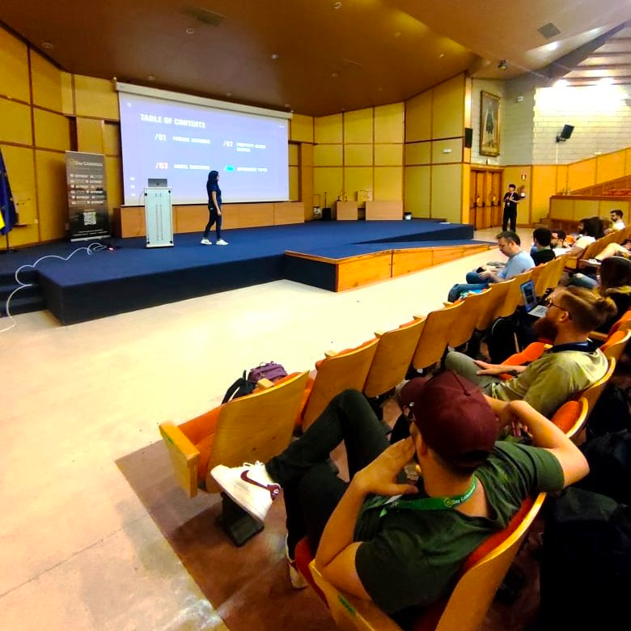
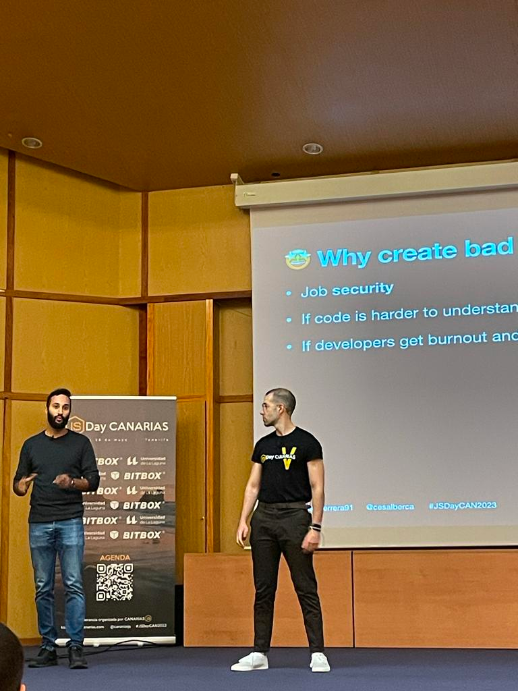

<!-- START doctoc generated TOC please keep comment here to allow auto update -->
<!-- DON'T EDIT THIS SECTION, INSTEAD RE-RUN doctoc TO UPDATE -->
## Índice

- [Road to JSDay Canarias 2023](#road-to-jsday-canarias-2023)
  - [Ruta por Chinyero](#ruta-por-chinyero)
  - [Ruta por Benijo](#ruta-por-benijo)
  - [Ruta por el Teide](#ruta-por-el-teide)
  - [Visitar oficinas de Lean Mind](#visitar-oficinas-de-lean-mind)
  - [Meetup Agile Canarias](#meetup-agile-canarias)
  - [JSDay Canarias 2023](#jsday-canarias-2023)
  - [Conclusión](#conclusi%C3%B3n)

<!-- END doctoc generated TOC please keep comment here to allow auto update -->

# Road to JSDay Canarias 2023

Llega otro año nuevo y con ello nueva edición de uno de mis eventos favoritos: [JSDay Canarias 2023](https://jsdaycanarias.com/). Este año conté con la suerte de presentar charla junto a [Adrián Ferrera](https://adrianferrera.dev/es). En la charla hablamos de cómo hacer código que haría vomitar a una cabra 🐐.

Este año, ([Luis Merino](https://twitter.com/luismeruli), [Rubén Yañez](https://twitter.com/conrderuben1) y yo) decidimos organizar una estancia un poco más larga en la isla y alquilamos un piso durante 1 mes en [Puerto de la Cruz](https://goo.gl/maps/V7KQwqkVR6931DEX8). Durante ese mes estaríamos teletrabajando, una de las muchas flexibilidades que aporta trabajar en Autentia. Puerto de la Cruz, además, está cerca de donde vive otro compañero, [Germán Delgado](https://twitter.com/GermanDG6). Aprovechamos para disfrutar y explorar de la isla juntos. Estas son algunas de las cosas que hicimos:

## Ruta por Chinyero

Organizamos una caminata por una de las muchas joyas naturales de la isla: el sendero de Chinyero. Este sendero, que recorre el área alrededor del volcán Chinyero, último en erupcionar en la isla en 1909, nos ofreció una ventana única a la historia geológica de Tenerife y una inmersión en su rica biodiversidad.

La ruta, que abarcaba aproximadamente 10 kilómetros, nos condujo a través de una variedad de paisajes volcánicos, desde campos de lava solidificada hasta exuberantes bosques de pinos canarios. Fue interesante notar las marcas de la actividad volcánica en la tierra y ver cómo la naturaleza se ha adaptado y florecido en estas condiciones.

El sendero es en su mayoría accesible y bien marcado, aunque a punto estuvimos de perdernos en un despiste que supimos enmendar rápidamente. Durante el recorrido, pudimos sentir cómo cambia rápidamente la temperatura y el clima en cuestión de pocos kilómetros.

## Ruta por Benijo

En esta ocasión optamos por una ruta de costa y el lugar ideal para ello era Benijo. Esta caminata, aunque menos conocida que algunas de las rutas más populares de la isla, no nos decepcionó en absoluto, mostrándonos una faceta menos explorada pero igualmente deslumbrante de Tenerife.

La ruta comenzó en Benijo, un pintoresco pueblo en el norte de la isla, conocido por su playa de arena negra volcánica y las impresionantes vistas del océano Atlántico. Desde allí, emprendimos la senda hacia el Draguillo, atravesando la extensa belleza natural del Parque Rural de Anaga, declarado Reserva de la Biosfera por la UNESCO.

Este camino nos llevó a través de escarpados acantilados e impresionantes vistas costeras. La distancia total de la ruta es de aproximadamente 7 kilómetros, y aunque hay algunos tramos empinados, el esfuerzo se vio ampliamente recompensado por las vistas panorámicas y el contacto con la exuberante naturaleza.

Después de la caminata, volvimos a Benijo, donde tuvimos la oportunidad de disfrutar de la deliciosa cocina local en uno de sus restaurantes con vista al mar. La comida, con productos frescos y autóctonos, fue un gran broche de oro para un día de aventura.

Después de comer terminamos el día en la playa de Benijo, relajándonos en su característica arena negra mientras admirábamos todo el paisaje a nuestro alrededor.

Paisaje que hay que preservar. Germán no dudó en recoger unos trozos de plástico que divisó en la orilla.

¡Y nada mejor que acabar un día de caminata con un buen baño!

## Ruta por el Teide

Una de las experiencias más impactantes que tuvimos en Tenerife fue una audaz expedición nocturna al pico del Teide, con el objetivo de saludar al amanecer desde el punto más alto de España. Esta aventura, aunque desafiante, fue sin duda una de las más gratificantes y mágicas de nuestra visita a la isla.

La excursión comenzó a las 19:00, hora a la que nos dirigimos a la base del Teide donde íbamos a encontrarnos con un grupo de nómadas digitales que había alquilado un telescopio para ver las estrellas y de los cuáles 3 se unirían a nuestra expedición a la cumbre del Teide.

La ruta comenzaría a las 00:00, pero siempre es buena idea ir a la base del Teide con tiempo –que está a 2.356 m de altura– para aclimatarse, ya que no queríamos padecer mal de alturas. Aprovechamos a cenar, echar una cabezadita, ya que estaríamos caminando toda la noche.

El ascenso, que cubre un desnivel de más de 1,600 metros, es empinado y puede ser exigente, pero la belleza surrealista del paisaje nocturno compensó cada paso.

Según íbamos a ascendiendo la temperatura hacía lo propio y descendía a su vez. Llegando fácilmente a los 0º. Sabíamos que haría frío, así que íbamos preparados con mantas, un montón de capas y té caliente. Hacíamos paradas obligadas cada 30 minutos de 10 minutos, para ir aclimatándonos a la altura. Aprovechábamos estas paradas para hidratarnos y ver las estrellas, que dado que era luna nueva se podían ver con una claridad absoluta.

Llegados a la base del teleférico, que se encuentra 3.555 m de altura, hicimos una parada de media hora para recuperar fuerzas y así poder enfrentarnos a los últimos metros para llegar al pico, que se encuentra a 3.715 m de altura. Este último tramo hacía que el corazón se le desbocara a uno completamente, debido a la incipiente falta de oxígeno y al cansancio acumulado.

Llegamos a la cima justo a tiempo para el amanecer. Ver el nuevo día desde el pico del Teide es una experiencia indescriptible. El cielo comenzó a iluminarse gradualmente, primero con un delicado rosa, luego con tonos más vibrantes de naranja y dorado. Cuando el sol finalmente emergió, iluminando el impresionante paisaje volcánico a nuestro alrededor, la vista era simplemente impresionante.

Y por supuesto no nos olvidamos de mirar atrás para ver la descomunal sombra que se proyecta sobre el océano.

## Visitar oficinas de Lean Mind

También tuvimos la oportunidad de visitar y trabajar desde las oficinas de [Lean Mind](https://leanmind.es/), una empresa local de tecnología reconocida por su enfoque ágil y orientado a las personas, bajo el mando de [Carlos Blé](https://www.carlosble.com/). El equipo de Lean Mind nos recibió con calidez, creando una atmósfera que hizo que trabajar desde allí se sintiera como en casa. Pasamos parte del día intercambiando ideas y en el caso de Adrián y mío, aprovechamos a darle los últimos toques a la charla.

Para el almuerzo, decidimos traer un toque de sabor latino a la oficina con unas deliciosas arepas. Comer juntos, compartir platos y conversaciones, no solo nos permitió disfrutar de una comida deliciosa, sino que también fortaleció nuestra conexión con el equipo de Lean Mind.

## Meetup Agile Canarias

Nuestra aventura en Tenerife no fue solo de descubrimientos naturales, sino también de conexiones y aprendizaje tecnológico. Tuvimos la oportunidad de asistir al Agile Canarias, un evento que reúne a profesionales y entusiastas de la tecnología para compartir ideas, discutir tendencias emergentes y fomentar una comunidad de innovación.

Uno de los aspectos más destacados del evento fue la charla de Luis Merino sobre inteligencia artificial (IA). Luis ofreció una presentación detallada y accesible. Explicó los fundamentos de la inteligencia artificial, sus aplicaciones prácticas y la historia que hay detrás. Fue una charla fascinante que logró hacer que un tema tan complejo fuera comprensible y relevante para todos los presentes.

[Daniel Ramos](https://twitter.com/DanielRamosAcos) nos iluminó con su approach para implementar una funcionalidad sobre un pet project usando TDD. Él es partidario de la escuela Outside In de Chicago y nos enseñó cómo con ella podía hacer que sus desarrollos sean más robustos a la par que flexibles.

Fran Palacios nos habló acerca de Web3 y cómo podemos demistificar este nuevo término que tanto hemos visto en los últimos años. Montó un ejemplo de cómo integrar Ethereum y smart contracts con React para tener un backend descentralizado.

Más tarde, Adrián Ferrera y yo pudimos practicar nuestra charla "101. How to build Bad Software", que días más tarde daríamos en la JSDay Canarias. En lugar de centrarnos en cómo construir software "bueno", optamos por un enfoque un tanto inusual y decidimos hablar sobre cómo construir "mal" software. A través de este contrapunto, buscamos ilustrar los errores comunes, las trampas y los malentendidos que pueden surgir en el proceso de desarrollo de software. Con humor (o eso intentamos), tratamos de ofrecer valiosas lecciones aprendidas de nuestros propios fracasos y éxitos en el campo. La charla fue bien recibida, con los asistentes participando activamente en la discusión.

El meetup Agile Canarias resultó ser una experiencia enriquecedora, tanto en términos de aprendizaje como de networking. Además de las charlas, hubo oportunidades para interactuar con otros profesionales, intercambiar ideas y establecer conexiones valiosas. Esta mezcla de aprendizaje, compartir y conectarse, fue un recordatorio de la importancia de la comunidad en el rápido y siempre cambiante mundo de la tecnología.

Es más, todo el mundo sabe que lo importante de los eventos es el _post evento_, por ende fuimos a un local cercano donde prácticamente ocupamos toda una planta y estuvimos debatiendo sobre el tema que nos une y apasiona: la tecnología.

## JSDay Canarias 2023

¡Y comenzamos con el evento! Este año el evento contaba con un ambiente mucho más internacional, con 26 charlas en inglés y 9 en español. Como cabeza de cartel tuvimos el privilegio de contar con figuras como [Kent C. Dodds](https://kentcdodds.com/), [Tejas Kumar](https://tej.as/), [Sandrina Pereira](https://www.sandrina-p.net/) y [muchos otros](https://jsdaycanarias.com/speakers)!

El evento tuvo lugar en [La Universidad de La Laguna](https://www.google.com/maps/search/28.468627,+-16.303659?shorturl=1), en el campus Guajara.

Kent C. Dodds estrenó el escenario con su charla Making Felix Felicis donde nos habla de cómo fabricar nuestra propia suerte.

Siguiendo sus consejos en la charla, probamos suerte y tuvo la amabilidad de hacerse una foto con nosotros.

Tejas nos contó cómo usar Zod y tRPC, unas tecnologías que se compenetra muy bien y permiten tener tipado llamadas y respuestas de un backend usando el protocolo RPC.

Anna Salas nos contó cómo usa Storybook y los plugins que suele utilizar en su día a día para hacer Design Systems.

Braulio Diez y Daniel Sánchez profundizaron en temas de rendering y de cómo los frameworks más novedosos usan "surgical updates" para ser más eficientes.

Tuvimos también un panel tecnológico con grandes personalidades como: Kent C. Dodds, Aleksandra Sikora, Adrián Bolonio y Natalia Rocha.

Jorge Aguiar Martin completó la primera jornada hablándonos de cómo mejorar nuestros tests con Jest añadiendo métodos al objeto expect para que estos sean más semánticos.

No podía faltar una visita al Bola 8, donde pudimos coincidir con gente del evento e incluso tuvimos un arduo partido de futbolín con el equipo de Lean Mind.

En la segunda jornada Fernanda Andrade nos habló de herramientas de testing aplicadas a tipos.

José Manuel Lucas hizo de un tema complejo como es la programación funcional fácil de entender usando fp-ts.

A continuación Adrián Ferrera y yo dimos nuestra charla "101. How to build bad Software", donde hablábamos de cómo hacer código que haría vomitar a una cabra.

Tally Barak nos habló en su charla acerca de Monorepos y qué estrategias seguir para usar la herramienta correcta.

Y por último Thomas Steiner nos contó cómo usar Web SQL para crear aplicaciones web con bases de datos en el front.

Estas fueron algunas de las charlas a la que pude asistir, habiendo [muchas otras](https://jsdaycanarias.com/agenda) igual de interesantes y apasionantes.

Y por supuesto no podía faltar el post-evento donde esta vez fuimos al Rincón de Tintín y nos juntamos con un grupazo de gente donde pudimos compartir incluso más experiencias y charlas enriquecedoras.

## Conclusión

En resumen, nuestras aventuras en Tenerife nos permitieron explorar la diversidad natural y cultural de la isla. Desde los senderos de Chinyero hasta la excursión al Draguillo y la ascensión nocturna al pico del Teide. Suplimos el aspecto cultural y deportivo con jornadas de compartir conocimiento y estrechar lazos con las muchas magníficas personas que coincidimos. ¡Hasta la próxima Canarias!

