Cómo sobrevivir a un proyecto grande de JavaScript: Oda a TypeScript. En este tutorial compararemos JavaScript con TypeScript y veremos lo que nos ofrece y por qué hará que tengamos hasta un 15% de bugs menos.
<!--more-->

<!-- START doctoc generated TOC please keep comment here to allow auto update -->
<!-- DON'T EDIT THIS SECTION, INSTEAD RE-RUN doctoc TO UPDATE -->
## Índice

- [1. Introducción](#1-introducci%C3%B3n)
- [2. Introducción a TypeScript](#2-introducci%C3%B3n-a-typescript)
- [3. Características del lenguaje](#3-caracter%C3%ADsticas-del-lenguaje)
- [4. Desventajas](#4-desventajas)
- [5. Ejemplo](#5-ejemplo)
- [6. Comparativa](#6-comparativa)
  - [6.1. Tipos básicos](#61-tipos-b%C3%A1sicos)
  - [6.2. Null y undefined](#62-null-y-undefined)
  - [6.3. Funciones](#63-funciones)
  - [6.4. Interfaces](#64-interfaces)
  - [6.5. Clases](#65-clases)
- [7. Comparativa con código real](#7-comparativa-con-c%C3%B3digo-real)
- [8. Conclusión](#8-conclusi%C3%B3n)

<!-- END doctoc generated TOC please keep comment here to allow auto update -->

## 1. Introducción

Históricamente JavaScript ha sido conocido por su flexibilidad, pero, en proyectos grandes o con cierta complejidad esta flexibilidad se vuelve un punto negativo, dado que pasamos de ser flexibles a ser laxos.
¿A qué nos referimos con ser laxos? Pues a que la experiencia del desarrollo se vuelve una carga, dado que:

* Desconocemos los tipos con los que tratamos.
* La introducción de bugs puede aumentar hasta un 15% en producción. (https://blog.acolyer.org/2017/09/19/to-type-or-not-to-type-quantifying-detectable-bugs-in-javascript/).
* La documentación exhaustiva del código es necesaria para determinar con qué estructuras de datos estamos tratando.
* Las ayudas del lenguaje son nimias.
* Los refactors automáticos prácticamente son inexistentes (resulta casi imposible hasta cosas tan sencillas como cambiar de nombre una variable o función).

Y esta problemática no es ni mucho menos por la falta de herramientas de desarrollo, sino más bien por la propia naturaleza del lenguaje.

## 2. Introducción a TypeScript

Por todos los problemas mencionados anteriormente es por lo que surgió TypeScript. Microsoft lanzó este proyecto en octubre de 2012 y cuenta con una gran aceptación dentro de la comunidad, siendo el lenguaje de los más valorados de la [prestigiosa encuesta anual de Stackoverflow](https://insights.stackoverflow.com/survey/2018#most-loved-dreaded-and-wanted).
Y no solamente es de los más valorados, si no que también se usa en un amplio espectro de [proyectos y de frameworks distintos](https://stateofjs.com/2017/connections/).

Empresas como Google, Github, Adobe, Walmart, Slack, Microsoft, JetBrains y Netflix hacen uso de TypeScript, con lo que es de esperar que tenga una larga vida, y más aún cuando proyectos como Angular y Vue fomentan de forma tan activa el uso de TypeScript.

Por último, Microsoft tiene un gran aliciente para continuar el desarrollo de TypeScript y es la transformación que ha sufrido la empresa en la última década, dedicando muchos recursos a la creación de proyectos libres y abiertos por y para la comunidad (VSCode, TypeScript, ReactXP, API REST Guidelines, etc).

## 3. Características del lenguaje

En JavaScript, aunque sea dinámico podemos obtener ciertas ayudas que mejoran nuestra experiencia de desarrollo.

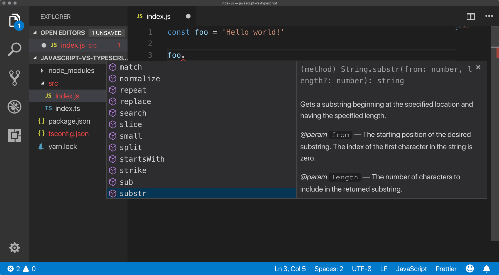

Las herramientas actuales son capaces de inferir que `foo` es de tipo String, con lo que nos ofrece todos los métodos de los que dispone la clase String. Esta inferencia no es magia. Microsoft ha tipado todos los elementos de JavaScript en lo que se denomina una definición de tipos (hecha, irónicamente en TypeScript, y de la cual se aprovechan muchos IDEs). Muchas bibliotecas incluyen definiciones de tipos para su API pública.

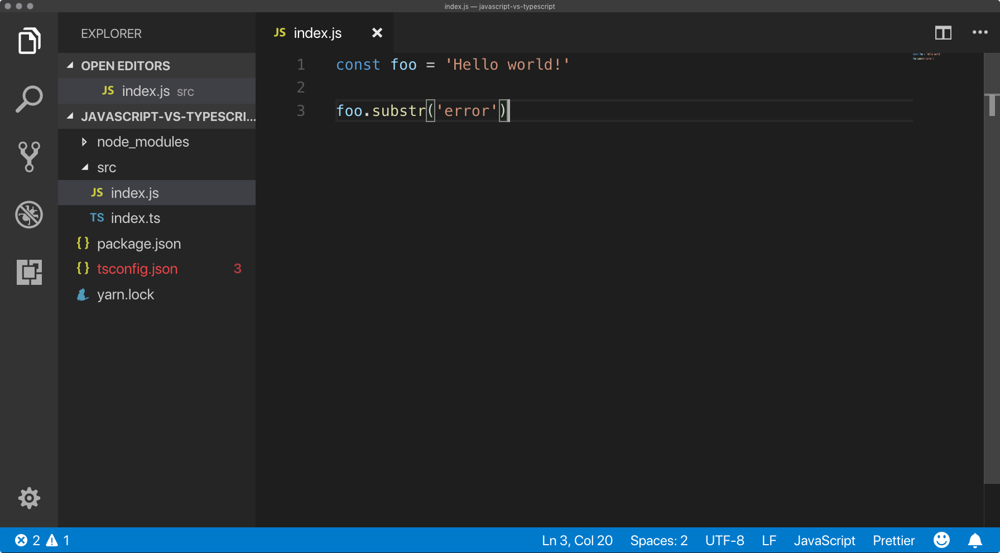

¿Pero qué ocurre cuando invocamos substr con un parámetro incorrecto? No nos aparece error, porque no sabe si en algún momento `foo` se vuelve de otro tipo y ese tipo cuenta con un método substr. En este caso dará un error en tiempo de ejecución.
¿Qué pasa si hacemos lo mismo en TypeScript?

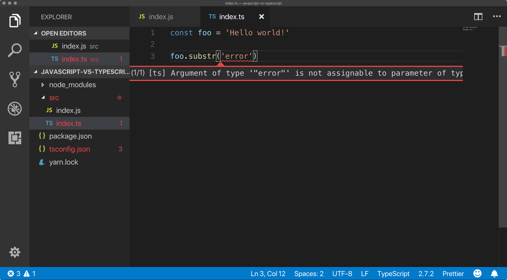

Cuando usamos TypeScript, el lenguaje es capaz de saber que `foo` no ha cambiado de tipo, con lo que te avisa que substr no puedes invocarlo con un argumento que no sea un número.
Este tipo de ayudas se empieza a notar cuando tenemos ficheros que exportan tipos, valores o funciones. TypeScript es capaz de darnos toda la ayuda necesaria para hacer un uso correcto de los mismos.

Podemos tipar nuestros objetos con interfaces y hacer uso de estas para poder tratar de forma mucho más óptima con los objetos:

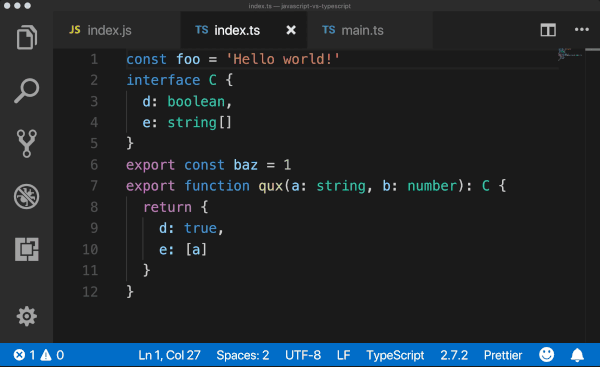

Y además, podemos acceder a todo tipo de refactors, extracciones e incluso auto-imports:

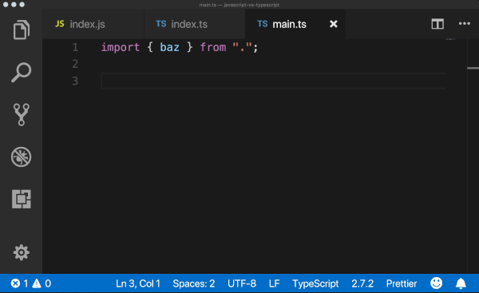

Todo lo que hemos mostrado no es más que la punta del iceberg, aunque realmente, para obtener beneficios sustanciales la inversión de esfuerzo es mínima, ya que solamente con tipar nuestras variables y funciones obtendremos una gran parte de las ventajas de TypeScript.

## 4. Desventajas

Una desventaja de TypeScript es la introducción de más complejidad en la parte de configuración nuestro proyecto. Es una dependencia más que hay que actualizar, configurar y gestionar.

Si bien TypeScript cuenta con una curva de aprendizaje y esto se puede ver como una desventaja, no olvidemos que esta es muy leve, ya que TypeScript parte de JavaScript, teniendo ambos una sintaxis muy similar y TypeScript sólo añade el tipado.

## 5. Ejemplo

Desde luego lo mejor para ver el potencial de TypeScript es usarlo. Por tanto he preparado un repositorio de un proyecto hecho con [Vue](https://vuejs.org/). Para apreciar los cambios realizados más concretamente es interesante ver esta esta [PR](https://github.com/cesalberca/curiosity-client/pull/1)
.

Se recomienda encarecidamente que se descargue el código, se instale depencias con `yarn install` o `npm install`, se compile y se abra con VSCode o con WebStorm (TypeScript cuenta con soporte para un amplio abanico de IDEs - https://www.typescriptlang.org - Sección “Get TypeScript”). Y ver que la experiencia de desarrollo es abrumadoramente buena.

## 6. Comparativa

Esta comparativa que se mostrará a continuación viene con un repositorio de ejemplo: https://github.com/cesalberca/ts-vs-js

### 6.1. Tipos básicos

JavaScript:

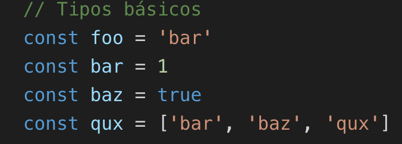

TypeScript:

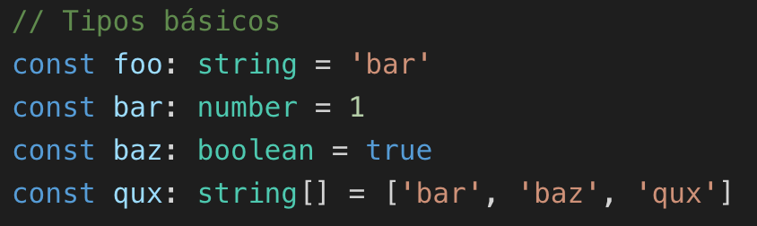

Nota: En este caso **todos los tipos** del ejemplo de TypeScript se pueden omitir, dado que TypeScript cuenta con inferencia de tipos.

### 6.2. Null y undefined

JavaScript:

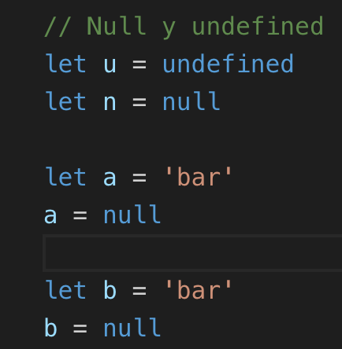

TypeScript:

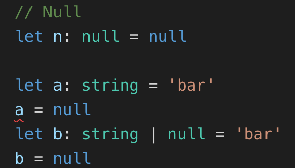

En el caso de TypeScript, una variable con un tipo String nunca va a poder ser de tipo nula, con lo cual no compila. En el caso siguiente, cuando una variable puede ser nulable e invoquemos métodos o propiedades sobre esa variable el compilador nos obligará a comprobar que es nula, dándonos más seguridad frente a nulos que JavaScript.

### 6.3. Funciones

JavaScript:

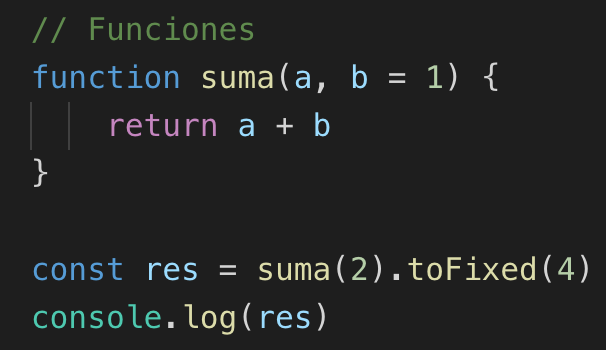

TypeScript:

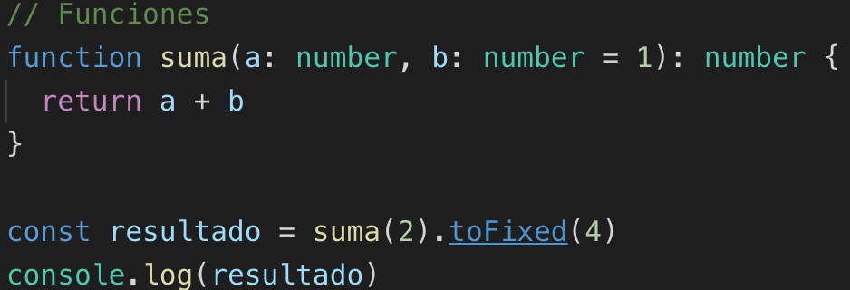

### 6.4. Interfaces

JavaScript:

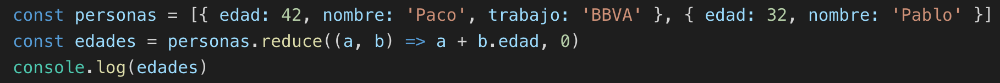

TypeScript:

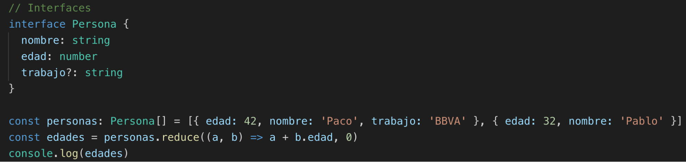

En este caso al tratar con la interfaz Persona, sabemos en todo momento qué propiedades tiene y nos avisa cuando tratamos de acceder a una propiedad que no existe. Si modificamos una propiedad de la interfaz, nos obliga a cambiar su uso, lo que facilita en gran medida los refactors.

### 6.5. Clases

JavaScript:

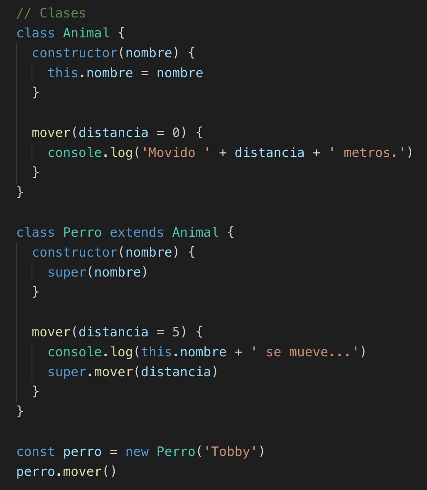

TypeScript:

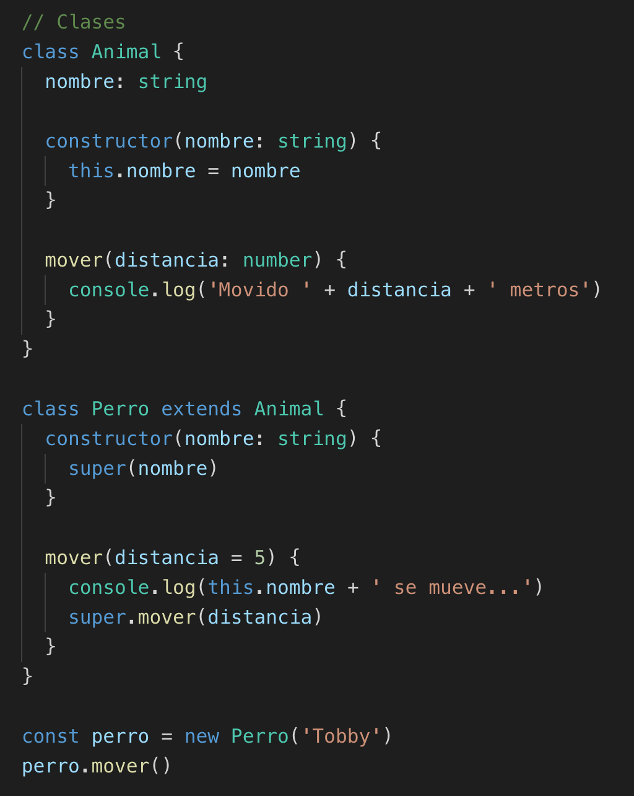

Las clases son propias de JavaScript, solo que al añadir tipos, obtenemos toda lo potencia de TypeScript, con todas las ayudas y la detección de errores.

## 7. Comparativa con código real

Aquí mostraremos las principales diferencias de código real entre TypeScript y JavaScript.

JavaScript:

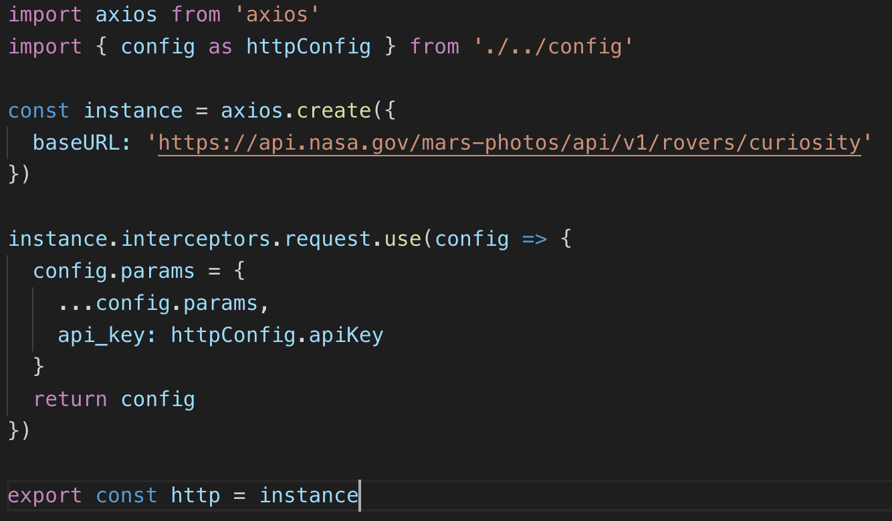

TypeScript:

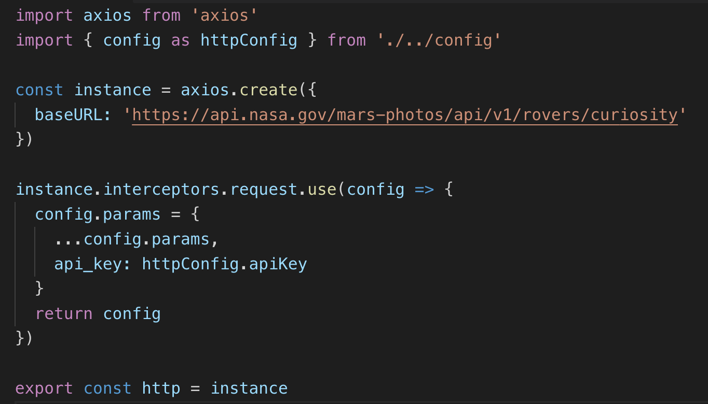

Como se puede observar TypeScript cuenta con una inferencia de tipos muy determinista, con lo que en muchos casos se pueden obviar __por completo__, como es en este caso, donde no hay ninguna diferencia.
Axios (https://github.com/axios/axios), es una biblioteca externa, y como muchas otras cuenta con una definición de tipos propia para TypeScript, lo que hace que trabajar con bibliotecas externas facilite mucho el desarrollo. Aunque recordemos que TypeScript y JavaScript son 100% interoperables, con lo que no necesitamos que una biblioteca hecha en JavaScript tenga definición de tipos para poder usarla.

¿Y qué pasa si una biblioteca no tiene oficialmente una definición de tipos? ¿Tendremos que hacerla nosotros? ¿O habrá alguna ya disponbile? En la mayor parte de los casos sí, TypeScript cuenta con un repositorio enorme de definiciones de tipos que son llevadas por la comunidad de aquellos paquetes que no tienen sus propias definiciones. Este repositorio es DefinitelyTyped (https://github.com/DefinitelyTyped/DefinitelyTyped).

JavaScript:

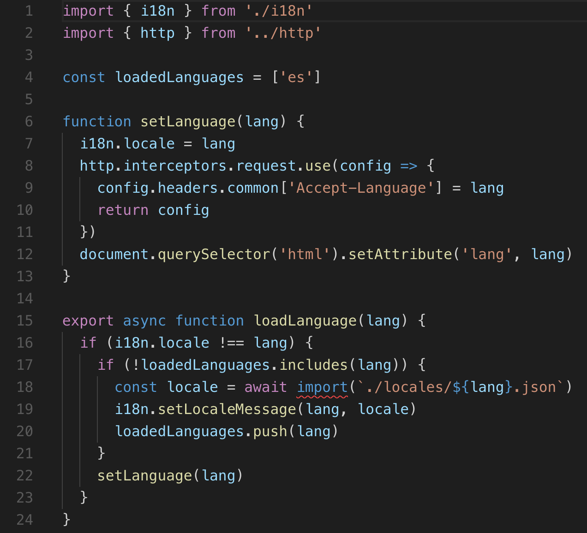

TypeScript:

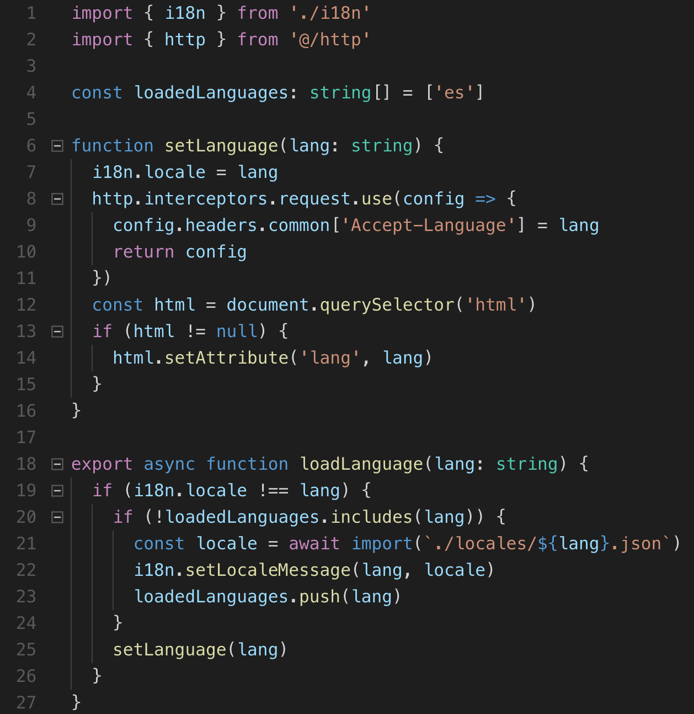

En este ejemplo vemos que hemos introducido tipos propios de TypeScript. Aunque no diste mucho de JavaScript solamente con introducir los tipos obtenemos todas las ventajas que ofrece el lenguaje.
También vemos que en el fichero de TypeScript, en la línea 13, hay un if. Este condicional se ha introducido porque TypeScript al ser fuertemente tipado, muestra un error cuando invocas una función sobre un objeto o propiedad que puede ser nulo. En este caso `querySelector` puede retornar nulo, con lo cual en tiempo de compilación te ayuda a detectar esta casuística.

JavaScript:

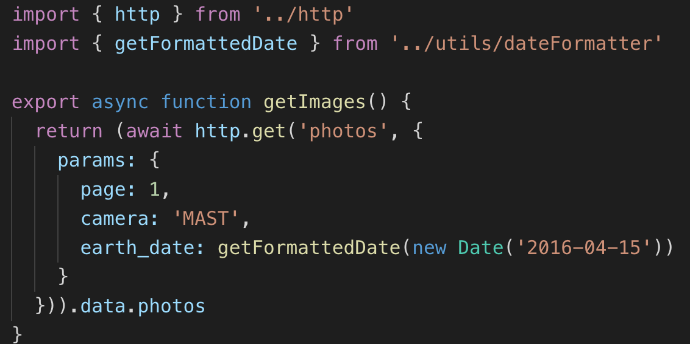

TypeScript:

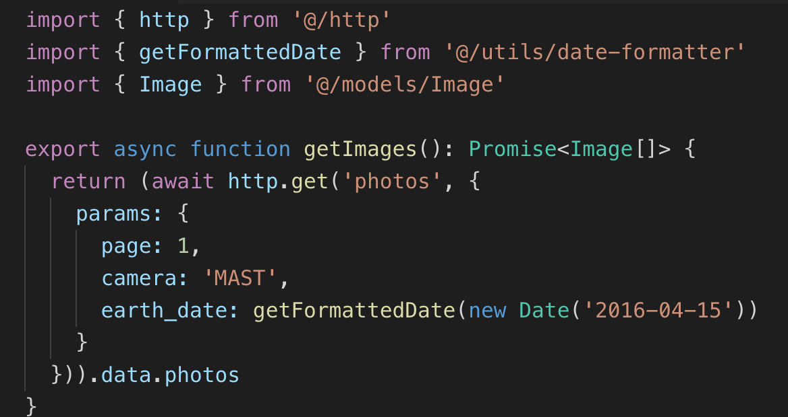

Con TypeScript podemos modelar los datos, como es el caso de la interface `Image`, con los que tratamos de tal forma que sabemos con qué elementos estamos trabajando y si estamos equivocados al llamar a una propiedad o método que no existe.

Además, en el primer ejemplo, para saber qué propiedades tiene el listado de imágenes que recuperamos tendríamos que consultar la API o la documentación. TypeScript sirve también como documentación viviente, con lo que aumenta considerablemente la velocidad de desarrollo.

## 8. Conclusión

TypeScript ofrece unas ventajas sobre JavaScript innegables, el overhead que introduce está más que justificado y la curva de aprendizaje es muy liviana, ya que recordemos, TypeScript no es más que un superset de JavaScript, dando a JavaScript nuevas funcionalidades pero respetando su esencia.
